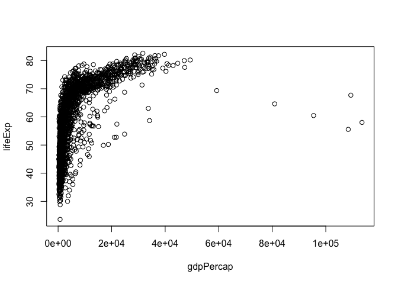
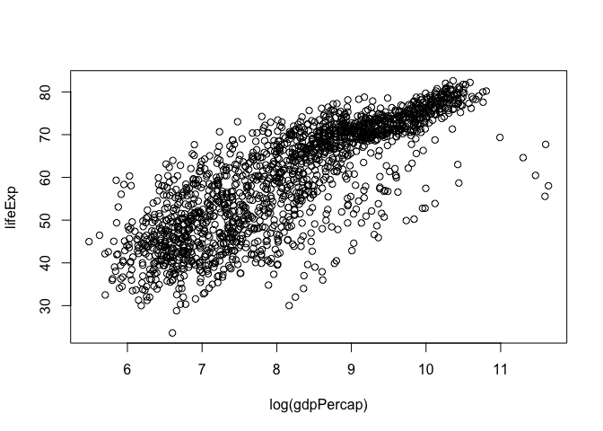
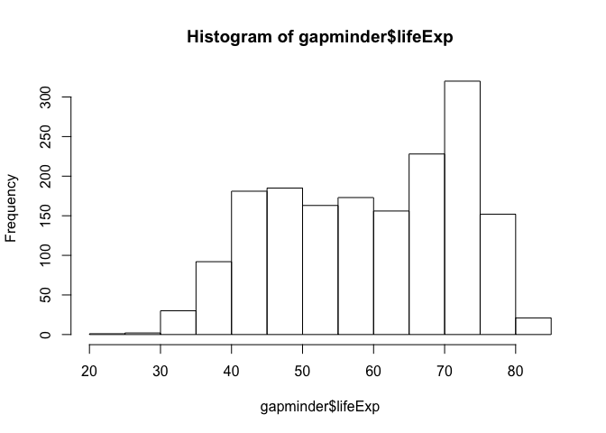
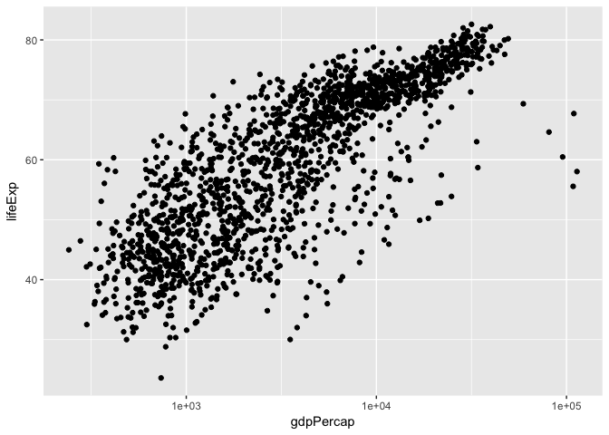
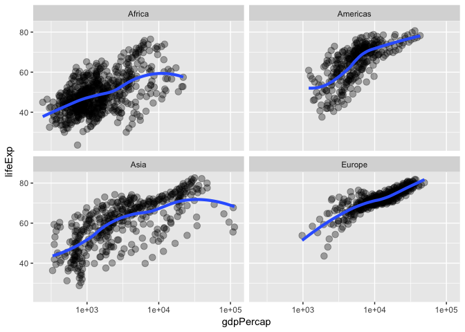

# Gapminder_Data_hw01


# Gapminder Dataset for hw01

## Load packages

Assuming both the gapminder and tidyverse packages are installed, load them using the following commands:


```r
library(gapminder)
library(tidyverse)
```

```
## Loading tidyverse: ggplot2
## Loading tidyverse: tibble
## Loading tidyverse: tidyr
## Loading tidyverse: readr
## Loading tidyverse: purrr
## Loading tidyverse: dplyr
```

```
## Conflicts with tidy packages ----------------------------------------------
```

```
## filter(): dplyr, stats
## lag():    dplyr, stats
```

## Explore dataset

Using the tidyverse meta-package, we can view the gapminder data frame as a 'tibble', and have a cleaner view of the dataset. 'names' returns all of the names in the dataframe, 'head' returns the first parts of the data frame, etc.


```r
gapminder
```

```
## # A tibble: 1,704 x 6
##        country continent  year lifeExp      pop gdpPercap
##         <fctr>    <fctr> <int>   <dbl>    <int>     <dbl>
##  1 Afghanistan      Asia  1952  28.801  8425333  779.4453
##  2 Afghanistan      Asia  1957  30.332  9240934  820.8530
##  3 Afghanistan      Asia  1962  31.997 10267083  853.1007
##  4 Afghanistan      Asia  1967  34.020 11537966  836.1971
##  5 Afghanistan      Asia  1972  36.088 13079460  739.9811
##  6 Afghanistan      Asia  1977  38.438 14880372  786.1134
##  7 Afghanistan      Asia  1982  39.854 12881816  978.0114
##  8 Afghanistan      Asia  1987  40.822 13867957  852.3959
##  9 Afghanistan      Asia  1992  41.674 16317921  649.3414
## 10 Afghanistan      Asia  1997  41.763 22227415  635.3414
## # ... with 1,694 more rows
```

```r
names(gapminder)
```

```
## [1] "country"   "continent" "year"      "lifeExp"   "pop"       "gdpPercap"
```

```r
head(gapminder)
```

```
## # A tibble: 6 x 6
##       country continent  year lifeExp      pop gdpPercap
##        <fctr>    <fctr> <int>   <dbl>    <int>     <dbl>
## 1 Afghanistan      Asia  1952  28.801  8425333  779.4453
## 2 Afghanistan      Asia  1957  30.332  9240934  820.8530
## 3 Afghanistan      Asia  1962  31.997 10267083  853.1007
## 4 Afghanistan      Asia  1967  34.020 11537966  836.1971
## 5 Afghanistan      Asia  1972  36.088 13079460  739.9811
## 6 Afghanistan      Asia  1977  38.438 14880372  786.1134
```

```r
tail(gapminder)
```

```
## # A tibble: 6 x 6
##    country continent  year lifeExp      pop gdpPercap
##     <fctr>    <fctr> <int>   <dbl>    <int>     <dbl>
## 1 Zimbabwe    Africa  1982  60.363  7636524  788.8550
## 2 Zimbabwe    Africa  1987  62.351  9216418  706.1573
## 3 Zimbabwe    Africa  1992  60.377 10704340  693.4208
## 4 Zimbabwe    Africa  1997  46.809 11404948  792.4500
## 5 Zimbabwe    Africa  2002  39.989 11926563  672.0386
## 6 Zimbabwe    Africa  2007  43.487 12311143  469.7093
```

```r
glimpse(gapminder)
```

```
## Observations: 1,704
## Variables: 6
## $ country   <fctr> Afghanistan, Afghanistan, Afghanistan, Afghanistan,...
## $ continent <fctr> Asia, Asia, Asia, Asia, Asia, Asia, Asia, Asia, Asi...
## $ year      <int> 1952, 1957, 1962, 1967, 1972, 1977, 1982, 1987, 1992...
## $ lifeExp   <dbl> 28.801, 30.332, 31.997, 34.020, 36.088, 38.438, 39.8...
## $ pop       <int> 8425333, 9240934, 10267083, 11537966, 13079460, 1488...
## $ gdpPercap <dbl> 779.4453, 820.8530, 853.1007, 836.1971, 739.9811, 78...
```

To obtain a basic statistical overview:


```r
summary(gapminder)
```

```
##         country        continent        year         lifeExp     
##  Afghanistan:  12   Africa  :624   Min.   :1952   Min.   :23.60  
##  Albania    :  12   Americas:300   1st Qu.:1966   1st Qu.:48.20  
##  Algeria    :  12   Asia    :396   Median :1980   Median :60.71  
##  Angola     :  12   Europe  :360   Mean   :1980   Mean   :59.47  
##  Argentina  :  12   Oceania : 24   3rd Qu.:1993   3rd Qu.:70.85  
##  Australia  :  12                  Max.   :2007   Max.   :82.60  
##  (Other)    :1632                                                
##       pop              gdpPercap       
##  Min.   :6.001e+04   Min.   :   241.2  
##  1st Qu.:2.794e+06   1st Qu.:  1202.1  
##  Median :7.024e+06   Median :  3531.8  
##  Mean   :2.960e+07   Mean   :  7215.3  
##  3rd Qu.:1.959e+07   3rd Qu.:  9325.5  
##  Max.   :1.319e+09   Max.   :113523.1  
## 
```
### Make some plots

Using base R graphics, make some figures!


```r
plot(lifeExp ~ year, gapminder)
```

<!-- -->

```r
plot(lifeExp ~ gdpPercap, gapminder)
```

<!-- -->

```r
plot(lifeExp ~ log(gdpPercap), gapminder)
```

<!-- -->

## Isolate a variable in the frame

To isolate one variable in the data frame, you use the $ sign. 

### Life Expectancy


```r
head(gapminder$lifeExp)
```

```
## [1] 28.801 30.332 31.997 34.020 36.088 38.438
```

```r
summary(gapminder$lifeExp)
```

```
##    Min. 1st Qu.  Median    Mean 3rd Qu.    Max. 
##   23.60   48.20   60.71   59.47   70.85   82.60
```

```r
hist(gapminder$lifeExp)
```

<!-- -->

### Distribution of observations across continents


```r
table(gapminder$continent)
```

```
## 
##   Africa Americas     Asia   Europe  Oceania 
##      624      300      396      360       24
```

```r
barplot(table(gapminder$continent))
```

<!-- -->

## Blindly make figures (for now)


```r
p <- ggplot(filter(gapminder, continent != "Oceania"),
            aes(x = gdpPercap, y = lifeExp)) # just initializes
p <- p + scale_x_log10() # log the x axis the right way
p + geom_point() # scatterplot
```

<!-- -->

```r
p + geom_point(aes(color = continent)) # map continent to color
```

<!-- -->

```r
p + geom_point(alpha = (1/3), size = 3) + geom_smooth(lwd = 3, se = FALSE)
```

```
## `geom_smooth()` using method = 'gam'
```

<!-- -->

```r
p + geom_point(alpha = (1/3), size = 3) + facet_wrap(~ continent) +
  geom_smooth(lwd = 1.5, se = FALSE)
```

```
## `geom_smooth()` using method = 'loess'
```

<!-- -->
