# hw02


```r
#+ setup, include = FALSE
library(knitr)
opts_chunk$set(fig.path = 'figure/scatterplot-', error = TRUE)
```


Fisrt, I'll call up the gapminder dataset and tidyverse package (meta-package that contains dplyr - what we are actually interested in).


```r
library(gapminder)
library(tidyverse)
```

```
## Loading tidyverse: ggplot2
## Loading tidyverse: tibble
## Loading tidyverse: tidyr
## Loading tidyverse: readr
## Loading tidyverse: purrr
## Loading tidyverse: dplyr
```

```
## Conflicts with tidy packages ----------------------------------------------
```

```
## filter(): dplyr, stats
## lag():    dplyr, stats
```

## Smell testing the data

#### Dataset type/class

One of the first questions to ask when working with a new dataset would be, what kind of form/structure does this dataset have? 

Because I have just done some reading about ```dplyr```, I assume (and know from previous assignments) that this is a dataframe, but if I wanted to confirm I could just call up the dataset to see a nicely formatted snippet of the rows and columns and what it is:


```r
gapminder
```

```
## # A tibble: 1,704 x 6
##        country continent  year lifeExp      pop gdpPercap
##         <fctr>    <fctr> <int>   <dbl>    <int>     <dbl>
##  1 Afghanistan      Asia  1952  28.801  8425333  779.4453
##  2 Afghanistan      Asia  1957  30.332  9240934  820.8530
##  3 Afghanistan      Asia  1962  31.997 10267083  853.1007
##  4 Afghanistan      Asia  1967  34.020 11537966  836.1971
##  5 Afghanistan      Asia  1972  36.088 13079460  739.9811
##  6 Afghanistan      Asia  1977  38.438 14880372  786.1134
##  7 Afghanistan      Asia  1982  39.854 12881816  978.0114
##  8 Afghanistan      Asia  1987  40.822 13867957  852.3959
##  9 Afghanistan      Asia  1992  41.674 16317921  649.3414
## 10 Afghanistan      Asia  1997  41.763 22227415  635.3414
## # ... with 1,694 more rows
```

Thanks to the tidyverse meta-package, this comes back as a nicely formatted tibble, and confirms we are working with a dataframe.

I can also use the ```typeof``` command to see the type or storage model of the object. This comes back as a ```list```. Upon investigating further and recalling info from previous classes, I can conclude that the gapminder dataset is both a list and a dataframe (a specific type of list). Some more info can be found here: https://stackoverflow.com/questions/15901224/what-is-difference-between-dataframe-and-list-in-r


```r
typeof(gapminder)
```

```
## [1] "list"
```


We can can also use the ```class``` command to see what type of data we are working with:


```r
class(gapminder)
```

```
## [1] "tbl_df"     "tbl"        "data.frame"
```

This command confirms that we are working with a table/dataframe. 

#### Dataset size & extent

To find out how many **columns**/variables, we simply use the ```ncol``` command, and similarly for the number of **rows**/observations


```r
ncol(gapminder)
```

```
## [1] 6
```

```r
nrow(gapminder)
```

```
## [1] 1704
```

Another way to get this information all at once (with one command) is the use the ```summarize``` function, but this requires some counting and deciphering to get the same information :


```r
summary(gapminder)
```

```
##         country        continent        year         lifeExp     
##  Afghanistan:  12   Africa  :624   Min.   :1952   Min.   :23.60  
##  Albania    :  12   Americas:300   1st Qu.:1966   1st Qu.:48.20  
##  Algeria    :  12   Asia    :396   Median :1980   Median :60.71  
##  Angola     :  12   Europe  :360   Mean   :1980   Mean   :59.47  
##  Argentina  :  12   Oceania : 24   3rd Qu.:1993   3rd Qu.:70.85  
##  Australia  :  12                  Max.   :2007   Max.   :82.60  
##  (Other)    :1632                                                
##       pop              gdpPercap       
##  Min.   :6.001e+04   Min.   :   241.2  
##  1st Qu.:2.794e+06   1st Qu.:  1202.1  
##  Median :7.024e+06   Median :  3531.8  
##  Mean   :2.960e+07   Mean   :  7215.3  
##  3rd Qu.:1.959e+07   3rd Qu.:  9325.5  
##  Max.   :1.319e+09   Max.   :113523.1  
## 
```

However, if you really want quick and specific information about the data, using the discrete commands such as ```ncol``` and ```nrow``` could be helpful. 

#### Variable types

To isolate one variable in the data frame, you use the $ sign. We can write code to tell us each variable type individually. The following commands tell us that each variable is an integer, apart from ```lifeExp``` and ```gdpPercap```.


```r
typeof(gapminder$country)
```

```
## [1] "integer"
```

```r
typeof(gapminder$continent)
```

```
## [1] "integer"
```

```r
typeof(gapminder$year)
```

```
## [1] "integer"
```

```r
typeof(gapminder$lifeExp)
```

```
## [1] "double"
```

```r
typeof(gapminder$pop)
```

```
## [1] "integer"
```

```r
typeof(gapminder$gdpPercap)
```

```
## [1] "double"
```

## Investigate individual variables

I'd like to take a closer look at lifeExp (quantitative - double) by country (categorical - integer type).

#### Possible values and range

First I'll look at the possible values for each category, starting with the possible entries for country. I can use ```levels``` to call up the full list of countries in the dataset, and ```nlevels``` to see the number of possible countries. I won't type the full list, but there are 142 countries in this dataset!


```r
levels(gapminder$country)
```

```
##   [1] "Afghanistan"              "Albania"                 
##   [3] "Algeria"                  "Angola"                  
##   [5] "Argentina"                "Australia"               
##   [7] "Austria"                  "Bahrain"                 
##   [9] "Bangladesh"               "Belgium"                 
##  [11] "Benin"                    "Bolivia"                 
##  [13] "Bosnia and Herzegovina"   "Botswana"                
##  [15] "Brazil"                   "Bulgaria"                
##  [17] "Burkina Faso"             "Burundi"                 
##  [19] "Cambodia"                 "Cameroon"                
##  [21] "Canada"                   "Central African Republic"
##  [23] "Chad"                     "Chile"                   
##  [25] "China"                    "Colombia"                
##  [27] "Comoros"                  "Congo, Dem. Rep."        
##  [29] "Congo, Rep."              "Costa Rica"              
##  [31] "Cote d'Ivoire"            "Croatia"                 
##  [33] "Cuba"                     "Czech Republic"          
##  [35] "Denmark"                  "Djibouti"                
##  [37] "Dominican Republic"       "Ecuador"                 
##  [39] "Egypt"                    "El Salvador"             
##  [41] "Equatorial Guinea"        "Eritrea"                 
##  [43] "Ethiopia"                 "Finland"                 
##  [45] "France"                   "Gabon"                   
##  [47] "Gambia"                   "Germany"                 
##  [49] "Ghana"                    "Greece"                  
##  [51] "Guatemala"                "Guinea"                  
##  [53] "Guinea-Bissau"            "Haiti"                   
##  [55] "Honduras"                 "Hong Kong, China"        
##  [57] "Hungary"                  "Iceland"                 
##  [59] "India"                    "Indonesia"               
##  [61] "Iran"                     "Iraq"                    
##  [63] "Ireland"                  "Israel"                  
##  [65] "Italy"                    "Jamaica"                 
##  [67] "Japan"                    "Jordan"                  
##  [69] "Kenya"                    "Korea, Dem. Rep."        
##  [71] "Korea, Rep."              "Kuwait"                  
##  [73] "Lebanon"                  "Lesotho"                 
##  [75] "Liberia"                  "Libya"                   
##  [77] "Madagascar"               "Malawi"                  
##  [79] "Malaysia"                 "Mali"                    
##  [81] "Mauritania"               "Mauritius"               
##  [83] "Mexico"                   "Mongolia"                
##  [85] "Montenegro"               "Morocco"                 
##  [87] "Mozambique"               "Myanmar"                 
##  [89] "Namibia"                  "Nepal"                   
##  [91] "Netherlands"              "New Zealand"             
##  [93] "Nicaragua"                "Niger"                   
##  [95] "Nigeria"                  "Norway"                  
##  [97] "Oman"                     "Pakistan"                
##  [99] "Panama"                   "Paraguay"                
## [101] "Peru"                     "Philippines"             
## [103] "Poland"                   "Portugal"                
## [105] "Puerto Rico"              "Reunion"                 
## [107] "Romania"                  "Rwanda"                  
## [109] "Sao Tome and Principe"    "Saudi Arabia"            
## [111] "Senegal"                  "Serbia"                  
## [113] "Sierra Leone"             "Singapore"               
## [115] "Slovak Republic"          "Slovenia"                
## [117] "Somalia"                  "South Africa"            
## [119] "Spain"                    "Sri Lanka"               
## [121] "Sudan"                    "Swaziland"               
## [123] "Sweden"                   "Switzerland"             
## [125] "Syria"                    "Taiwan"                  
## [127] "Tanzania"                 "Thailand"                
## [129] "Togo"                     "Trinidad and Tobago"     
## [131] "Tunisia"                  "Turkey"                  
## [133] "Uganda"                   "United Kingdom"          
## [135] "United States"            "Uruguay"                 
## [137] "Venezuela"                "Vietnam"                 
## [139] "West Bank and Gaza"       "Yemen, Rep."             
## [141] "Zambia"                   "Zimbabwe"
```

```r
nlevels(gapminder$country)
```

```
## [1] 142
```

OK now let's do that for our quantitative (double) variable - ```lifeExp```. Because we can summarize the range of this variable numerically, we will do this diffently. 


```r
summary(gapminder$lifeExp)
```

```
##    Min. 1st Qu.  Median    Mean 3rd Qu.    Max. 
##   23.60   48.20   60.71   59.47   70.85   82.60
```

The summary function gives us the minimum value (23.60), the maximum value (82.60), as well as the median and the mean. 

#### Spread and distribution 

I cannot make a histogram of country to see the distribution because it is not numeric, however, I can use the ```table``` command to build a contingency table of the counts for each country entry.


```r
table(gapminder$country)
```

```
## 
##              Afghanistan                  Albania                  Algeria 
##                       12                       12                       12 
##                   Angola                Argentina                Australia 
##                       12                       12                       12 
##                  Austria                  Bahrain               Bangladesh 
##                       12                       12                       12 
##                  Belgium                    Benin                  Bolivia 
##                       12                       12                       12 
##   Bosnia and Herzegovina                 Botswana                   Brazil 
##                       12                       12                       12 
##                 Bulgaria             Burkina Faso                  Burundi 
##                       12                       12                       12 
##                 Cambodia                 Cameroon                   Canada 
##                       12                       12                       12 
## Central African Republic                     Chad                    Chile 
##                       12                       12                       12 
##                    China                 Colombia                  Comoros 
##                       12                       12                       12 
##         Congo, Dem. Rep.              Congo, Rep.               Costa Rica 
##                       12                       12                       12 
##            Cote d'Ivoire                  Croatia                     Cuba 
##                       12                       12                       12 
##           Czech Republic                  Denmark                 Djibouti 
##                       12                       12                       12 
##       Dominican Republic                  Ecuador                    Egypt 
##                       12                       12                       12 
##              El Salvador        Equatorial Guinea                  Eritrea 
##                       12                       12                       12 
##                 Ethiopia                  Finland                   France 
##                       12                       12                       12 
##                    Gabon                   Gambia                  Germany 
##                       12                       12                       12 
##                    Ghana                   Greece                Guatemala 
##                       12                       12                       12 
##                   Guinea            Guinea-Bissau                    Haiti 
##                       12                       12                       12 
##                 Honduras         Hong Kong, China                  Hungary 
##                       12                       12                       12 
##                  Iceland                    India                Indonesia 
##                       12                       12                       12 
##                     Iran                     Iraq                  Ireland 
##                       12                       12                       12 
##                   Israel                    Italy                  Jamaica 
##                       12                       12                       12 
##                    Japan                   Jordan                    Kenya 
##                       12                       12                       12 
##         Korea, Dem. Rep.              Korea, Rep.                   Kuwait 
##                       12                       12                       12 
##                  Lebanon                  Lesotho                  Liberia 
##                       12                       12                       12 
##                    Libya               Madagascar                   Malawi 
##                       12                       12                       12 
##                 Malaysia                     Mali               Mauritania 
##                       12                       12                       12 
##                Mauritius                   Mexico                 Mongolia 
##                       12                       12                       12 
##               Montenegro                  Morocco               Mozambique 
##                       12                       12                       12 
##                  Myanmar                  Namibia                    Nepal 
##                       12                       12                       12 
##              Netherlands              New Zealand                Nicaragua 
##                       12                       12                       12 
##                    Niger                  Nigeria                   Norway 
##                       12                       12                       12 
##                     Oman                 Pakistan                   Panama 
##                       12                       12                       12 
##                 Paraguay                     Peru              Philippines 
##                       12                       12                       12 
##                   Poland                 Portugal              Puerto Rico 
##                       12                       12                       12 
##                  Reunion                  Romania                   Rwanda 
##                       12                       12                       12 
##    Sao Tome and Principe             Saudi Arabia                  Senegal 
##                       12                       12                       12 
##                   Serbia             Sierra Leone                Singapore 
##                       12                       12                       12 
##          Slovak Republic                 Slovenia                  Somalia 
##                       12                       12                       12 
##             South Africa                    Spain                Sri Lanka 
##                       12                       12                       12 
##                    Sudan                Swaziland                   Sweden 
##                       12                       12                       12 
##              Switzerland                    Syria                   Taiwan 
##                       12                       12                       12 
##                 Tanzania                 Thailand                     Togo 
##                       12                       12                       12 
##      Trinidad and Tobago                  Tunisia                   Turkey 
##                       12                       12                       12 
##                   Uganda           United Kingdom            United States 
##                       12                       12                       12 
##                  Uruguay                Venezuela                  Vietnam 
##                       12                       12                       12 
##       West Bank and Gaza              Yemen, Rep.                   Zambia 
##                       12                       12                       12 
##                 Zimbabwe 
##                       12
```

This shows me that there are 12 entries for each country, which should each correspond to a year in the series. For fun, I will confirm this assumption...


```r
list(gapminder$year)
```

```
## [[1]]
##    [1] 1952 1957 1962 1967 1972 1977 1982 1987 1992 1997 2002 2007 1952
##   [14] 1957 1962 1967 1972 1977 1982 1987 1992 1997 2002 2007 1952 1957
##   [27] 1962 1967 1972 1977 1982 1987 1992 1997 2002 2007 1952 1957 1962
##   [40] 1967 1972 1977 1982 1987 1992 1997 2002 2007 1952 1957 1962 1967
##   [53] 1972 1977 1982 1987 1992 1997 2002 2007 1952 1957 1962 1967 1972
##   [66] 1977 1982 1987 1992 1997 2002 2007 1952 1957 1962 1967 1972 1977
##   [79] 1982 1987 1992 1997 2002 2007 1952 1957 1962 1967 1972 1977 1982
##   [92] 1987 1992 1997 2002 2007 1952 1957 1962 1967 1972 1977 1982 1987
##  [105] 1992 1997 2002 2007 1952 1957 1962 1967 1972 1977 1982 1987 1992
##  [118] 1997 2002 2007 1952 1957 1962 1967 1972 1977 1982 1987 1992 1997
##  [131] 2002 2007 1952 1957 1962 1967 1972 1977 1982 1987 1992 1997 2002
##  [144] 2007 1952 1957 1962 1967 1972 1977 1982 1987 1992 1997 2002 2007
##  [157] 1952 1957 1962 1967 1972 1977 1982 1987 1992 1997 2002 2007 1952
##  [170] 1957 1962 1967 1972 1977 1982 1987 1992 1997 2002 2007 1952 1957
##  [183] 1962 1967 1972 1977 1982 1987 1992 1997 2002 2007 1952 1957 1962
##  [196] 1967 1972 1977 1982 1987 1992 1997 2002 2007 1952 1957 1962 1967
##  [209] 1972 1977 1982 1987 1992 1997 2002 2007 1952 1957 1962 1967 1972
##  [222] 1977 1982 1987 1992 1997 2002 2007 1952 1957 1962 1967 1972 1977
##  [235] 1982 1987 1992 1997 2002 2007 1952 1957 1962 1967 1972 1977 1982
##  [248] 1987 1992 1997 2002 2007 1952 1957 1962 1967 1972 1977 1982 1987
##  [261] 1992 1997 2002 2007 1952 1957 1962 1967 1972 1977 1982 1987 1992
##  [274] 1997 2002 2007 1952 1957 1962 1967 1972 1977 1982 1987 1992 1997
##  [287] 2002 2007 1952 1957 1962 1967 1972 1977 1982 1987 1992 1997 2002
##  [300] 2007 1952 1957 1962 1967 1972 1977 1982 1987 1992 1997 2002 2007
##  [313] 1952 1957 1962 1967 1972 1977 1982 1987 1992 1997 2002 2007 1952
##  [326] 1957 1962 1967 1972 1977 1982 1987 1992 1997 2002 2007 1952 1957
##  [339] 1962 1967 1972 1977 1982 1987 1992 1997 2002 2007 1952 1957 1962
##  [352] 1967 1972 1977 1982 1987 1992 1997 2002 2007 1952 1957 1962 1967
##  [365] 1972 1977 1982 1987 1992 1997 2002 2007 1952 1957 1962 1967 1972
##  [378] 1977 1982 1987 1992 1997 2002 2007 1952 1957 1962 1967 1972 1977
##  [391] 1982 1987 1992 1997 2002 2007 1952 1957 1962 1967 1972 1977 1982
##  [404] 1987 1992 1997 2002 2007 1952 1957 1962 1967 1972 1977 1982 1987
##  [417] 1992 1997 2002 2007 1952 1957 1962 1967 1972 1977 1982 1987 1992
##  [430] 1997 2002 2007 1952 1957 1962 1967 1972 1977 1982 1987 1992 1997
##  [443] 2002 2007 1952 1957 1962 1967 1972 1977 1982 1987 1992 1997 2002
##  [456] 2007 1952 1957 1962 1967 1972 1977 1982 1987 1992 1997 2002 2007
##  [469] 1952 1957 1962 1967 1972 1977 1982 1987 1992 1997 2002 2007 1952
##  [482] 1957 1962 1967 1972 1977 1982 1987 1992 1997 2002 2007 1952 1957
##  [495] 1962 1967 1972 1977 1982 1987 1992 1997 2002 2007 1952 1957 1962
##  [508] 1967 1972 1977 1982 1987 1992 1997 2002 2007 1952 1957 1962 1967
##  [521] 1972 1977 1982 1987 1992 1997 2002 2007 1952 1957 1962 1967 1972
##  [534] 1977 1982 1987 1992 1997 2002 2007 1952 1957 1962 1967 1972 1977
##  [547] 1982 1987 1992 1997 2002 2007 1952 1957 1962 1967 1972 1977 1982
##  [560] 1987 1992 1997 2002 2007 1952 1957 1962 1967 1972 1977 1982 1987
##  [573] 1992 1997 2002 2007 1952 1957 1962 1967 1972 1977 1982 1987 1992
##  [586] 1997 2002 2007 1952 1957 1962 1967 1972 1977 1982 1987 1992 1997
##  [599] 2002 2007 1952 1957 1962 1967 1972 1977 1982 1987 1992 1997 2002
##  [612] 2007 1952 1957 1962 1967 1972 1977 1982 1987 1992 1997 2002 2007
##  [625] 1952 1957 1962 1967 1972 1977 1982 1987 1992 1997 2002 2007 1952
##  [638] 1957 1962 1967 1972 1977 1982 1987 1992 1997 2002 2007 1952 1957
##  [651] 1962 1967 1972 1977 1982 1987 1992 1997 2002 2007 1952 1957 1962
##  [664] 1967 1972 1977 1982 1987 1992 1997 2002 2007 1952 1957 1962 1967
##  [677] 1972 1977 1982 1987 1992 1997 2002 2007 1952 1957 1962 1967 1972
##  [690] 1977 1982 1987 1992 1997 2002 2007 1952 1957 1962 1967 1972 1977
##  [703] 1982 1987 1992 1997 2002 2007 1952 1957 1962 1967 1972 1977 1982
##  [716] 1987 1992 1997 2002 2007 1952 1957 1962 1967 1972 1977 1982 1987
##  [729] 1992 1997 2002 2007 1952 1957 1962 1967 1972 1977 1982 1987 1992
##  [742] 1997 2002 2007 1952 1957 1962 1967 1972 1977 1982 1987 1992 1997
##  [755] 2002 2007 1952 1957 1962 1967 1972 1977 1982 1987 1992 1997 2002
##  [768] 2007 1952 1957 1962 1967 1972 1977 1982 1987 1992 1997 2002 2007
##  [781] 1952 1957 1962 1967 1972 1977 1982 1987 1992 1997 2002 2007 1952
##  [794] 1957 1962 1967 1972 1977 1982 1987 1992 1997 2002 2007 1952 1957
##  [807] 1962 1967 1972 1977 1982 1987 1992 1997 2002 2007 1952 1957 1962
##  [820] 1967 1972 1977 1982 1987 1992 1997 2002 2007 1952 1957 1962 1967
##  [833] 1972 1977 1982 1987 1992 1997 2002 2007 1952 1957 1962 1967 1972
##  [846] 1977 1982 1987 1992 1997 2002 2007 1952 1957 1962 1967 1972 1977
##  [859] 1982 1987 1992 1997 2002 2007 1952 1957 1962 1967 1972 1977 1982
##  [872] 1987 1992 1997 2002 2007 1952 1957 1962 1967 1972 1977 1982 1987
##  [885] 1992 1997 2002 2007 1952 1957 1962 1967 1972 1977 1982 1987 1992
##  [898] 1997 2002 2007 1952 1957 1962 1967 1972 1977 1982 1987 1992 1997
##  [911] 2002 2007 1952 1957 1962 1967 1972 1977 1982 1987 1992 1997 2002
##  [924] 2007 1952 1957 1962 1967 1972 1977 1982 1987 1992 1997 2002 2007
##  [937] 1952 1957 1962 1967 1972 1977 1982 1987 1992 1997 2002 2007 1952
##  [950] 1957 1962 1967 1972 1977 1982 1987 1992 1997 2002 2007 1952 1957
##  [963] 1962 1967 1972 1977 1982 1987 1992 1997 2002 2007 1952 1957 1962
##  [976] 1967 1972 1977 1982 1987 1992 1997 2002 2007 1952 1957 1962 1967
##  [989] 1972 1977 1982 1987 1992 1997 2002 2007 1952 1957 1962 1967 1972
## [1002] 1977 1982 1987 1992 1997 2002 2007 1952 1957 1962 1967 1972 1977
## [1015] 1982 1987 1992 1997 2002 2007 1952 1957 1962 1967 1972 1977 1982
## [1028] 1987 1992 1997 2002 2007 1952 1957 1962 1967 1972 1977 1982 1987
## [1041] 1992 1997 2002 2007 1952 1957 1962 1967 1972 1977 1982 1987 1992
## [1054] 1997 2002 2007 1952 1957 1962 1967 1972 1977 1982 1987 1992 1997
## [1067] 2002 2007 1952 1957 1962 1967 1972 1977 1982 1987 1992 1997 2002
## [1080] 2007 1952 1957 1962 1967 1972 1977 1982 1987 1992 1997 2002 2007
## [1093] 1952 1957 1962 1967 1972 1977 1982 1987 1992 1997 2002 2007 1952
## [1106] 1957 1962 1967 1972 1977 1982 1987 1992 1997 2002 2007 1952 1957
## [1119] 1962 1967 1972 1977 1982 1987 1992 1997 2002 2007 1952 1957 1962
## [1132] 1967 1972 1977 1982 1987 1992 1997 2002 2007 1952 1957 1962 1967
## [1145] 1972 1977 1982 1987 1992 1997 2002 2007 1952 1957 1962 1967 1972
## [1158] 1977 1982 1987 1992 1997 2002 2007 1952 1957 1962 1967 1972 1977
## [1171] 1982 1987 1992 1997 2002 2007 1952 1957 1962 1967 1972 1977 1982
## [1184] 1987 1992 1997 2002 2007 1952 1957 1962 1967 1972 1977 1982 1987
## [1197] 1992 1997 2002 2007 1952 1957 1962 1967 1972 1977 1982 1987 1992
## [1210] 1997 2002 2007 1952 1957 1962 1967 1972 1977 1982 1987 1992 1997
## [1223] 2002 2007 1952 1957 1962 1967 1972 1977 1982 1987 1992 1997 2002
## [1236] 2007 1952 1957 1962 1967 1972 1977 1982 1987 1992 1997 2002 2007
## [1249] 1952 1957 1962 1967 1972 1977 1982 1987 1992 1997 2002 2007 1952
## [1262] 1957 1962 1967 1972 1977 1982 1987 1992 1997 2002 2007 1952 1957
## [1275] 1962 1967 1972 1977 1982 1987 1992 1997 2002 2007 1952 1957 1962
## [1288] 1967 1972 1977 1982 1987 1992 1997 2002 2007 1952 1957 1962 1967
## [1301] 1972 1977 1982 1987 1992 1997 2002 2007 1952 1957 1962 1967 1972
## [1314] 1977 1982 1987 1992 1997 2002 2007 1952 1957 1962 1967 1972 1977
## [1327] 1982 1987 1992 1997 2002 2007 1952 1957 1962 1967 1972 1977 1982
## [1340] 1987 1992 1997 2002 2007 1952 1957 1962 1967 1972 1977 1982 1987
## [1353] 1992 1997 2002 2007 1952 1957 1962 1967 1972 1977 1982 1987 1992
## [1366] 1997 2002 2007 1952 1957 1962 1967 1972 1977 1982 1987 1992 1997
## [1379] 2002 2007 1952 1957 1962 1967 1972 1977 1982 1987 1992 1997 2002
## [1392] 2007 1952 1957 1962 1967 1972 1977 1982 1987 1992 1997 2002 2007
## [1405] 1952 1957 1962 1967 1972 1977 1982 1987 1992 1997 2002 2007 1952
## [1418] 1957 1962 1967 1972 1977 1982 1987 1992 1997 2002 2007 1952 1957
## [1431] 1962 1967 1972 1977 1982 1987 1992 1997 2002 2007 1952 1957 1962
## [1444] 1967 1972 1977 1982 1987 1992 1997 2002 2007 1952 1957 1962 1967
## [1457] 1972 1977 1982 1987 1992 1997 2002 2007 1952 1957 1962 1967 1972
## [1470] 1977 1982 1987 1992 1997 2002 2007 1952 1957 1962 1967 1972 1977
## [1483] 1982 1987 1992 1997 2002 2007 1952 1957 1962 1967 1972 1977 1982
## [1496] 1987 1992 1997 2002 2007 1952 1957 1962 1967 1972 1977 1982 1987
## [1509] 1992 1997 2002 2007 1952 1957 1962 1967 1972 1977 1982 1987 1992
## [1522] 1997 2002 2007 1952 1957 1962 1967 1972 1977 1982 1987 1992 1997
## [1535] 2002 2007 1952 1957 1962 1967 1972 1977 1982 1987 1992 1997 2002
## [1548] 2007 1952 1957 1962 1967 1972 1977 1982 1987 1992 1997 2002 2007
## [1561] 1952 1957 1962 1967 1972 1977 1982 1987 1992 1997 2002 2007 1952
## [1574] 1957 1962 1967 1972 1977 1982 1987 1992 1997 2002 2007 1952 1957
## [1587] 1962 1967 1972 1977 1982 1987 1992 1997 2002 2007 1952 1957 1962
## [1600] 1967 1972 1977 1982 1987 1992 1997 2002 2007 1952 1957 1962 1967
## [1613] 1972 1977 1982 1987 1992 1997 2002 2007 1952 1957 1962 1967 1972
## [1626] 1977 1982 1987 1992 1997 2002 2007 1952 1957 1962 1967 1972 1977
## [1639] 1982 1987 1992 1997 2002 2007 1952 1957 1962 1967 1972 1977 1982
## [1652] 1987 1992 1997 2002 2007 1952 1957 1962 1967 1972 1977 1982 1987
## [1665] 1992 1997 2002 2007 1952 1957 1962 1967 1972 1977 1982 1987 1992
## [1678] 1997 2002 2007 1952 1957 1962 1967 1972 1977 1982 1987 1992 1997
## [1691] 2002 2007 1952 1957 1962 1967 1972 1977 1982 1987 1992 1997 2002
## [1704] 2007
```

Though not the most elegant way of doing it, this confirms that there are 12 unique rows of data for each country, corresponding to distinct years.

Though a bit silly, we can also see this by making a histogram of ```year``` (12 values all with an equal frequency).


```r
hist(gapminder$year)
```

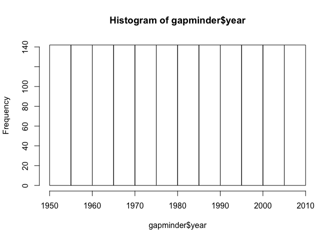<!-- -->

Now let's look at the spread or distribution of ```lifeExp``` - only let's do it visually using a histogram. I've gone ahead and looked up some formatting and added lines of central tendency so we can view these values on the histogram (and a legend to explain what they are!).


```r
hist(gapminder$lifeExp,
     col = "peachpuff", # now I am really curious to know what other colour options there are...
     border = "black")
abline(v = mean(gapminder$lifeExp), # adding lines for central tendency
	col = "royalblue",
	lwd = 2)
abline(v = median(gapminder$lifeExp),
	col = "red",
	lwd = 2)
legend(x = "topright", # location of legend within plot area
	c("Mean", "Median"),
	col = c("royalblue", "red"),
lwd = c( 2, 2))
```

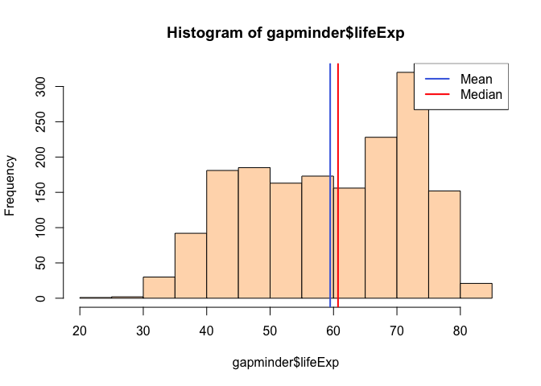<!-- -->

This allows us to see quite quickly that the histogram is slightly skewed to the left, as there are many entries/rows of data with values between 70 and 75. Using the ```summary``` function we can call up the precise values of the median (60.71), which is slightly higher than the mean (59.47). 


```r
summary(gapminder$lifeExp)
```

```
##    Min. 1st Qu.  Median    Mean 3rd Qu.    Max. 
##   23.60   48.20   60.71   59.47   70.85   82.60
```

## Exploring various plot types

#### Scatterplots


```r
ggplot(gapminder, aes(x = year, y = lifeExp)) # This just sets up the axes by assigning variables -- links certain scale to geometric object
```

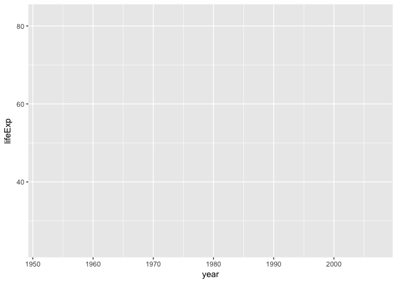<!-- -->

```r
ggplot(gapminder, aes(x = year, y = lifeExp)) + #adding the geom_point sets up the relationship for the scatterplot
  geom_point()
```

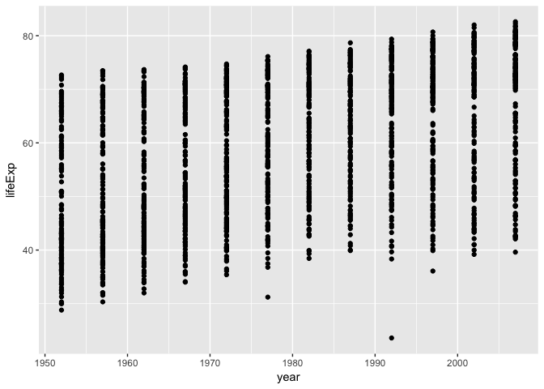<!-- -->

```r
p <- ggplot(gapminder, aes(x = year, y = lifeExp)) # this initializes the scatterplot
```

Let's also look at a scatterplot by two continuous variables to give us the full 'scatter' effect...


```r
ggplot(gapminder, aes(x = gdpPercap, y = lifeExp)) # This just sets up the axes by assigning variables
```

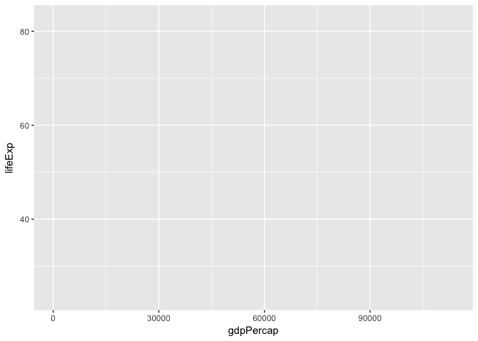<!-- -->

```r
ggplot(gapminder, aes(x = gdpPercap, y = lifeExp)) + #adding the geom_point sets up the relationship for the scatterplot
  geom_point()
```

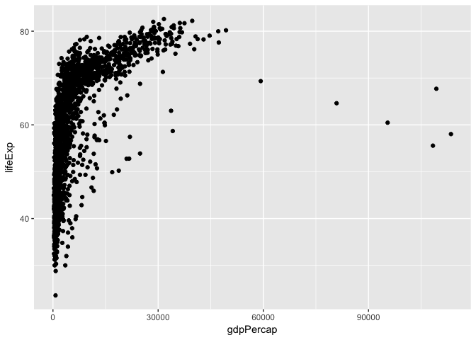<!-- -->

```r
p <- ggplot(gapminder, aes(x = gdpPercap, y = lifeExp)) # this initializes the scatterplot
```
Let's make that scatterplot a bit more visually appealing...


```r
p + geom_point() + scale_x_log10() # transforms the scatterplot to log scale
```

<!-- -->

```r
p <- p + scale_x_log10() # re-defining 'p' to integrate the transformation
p + geom_point(aes(color = continent)) # adding colur based on continent
```

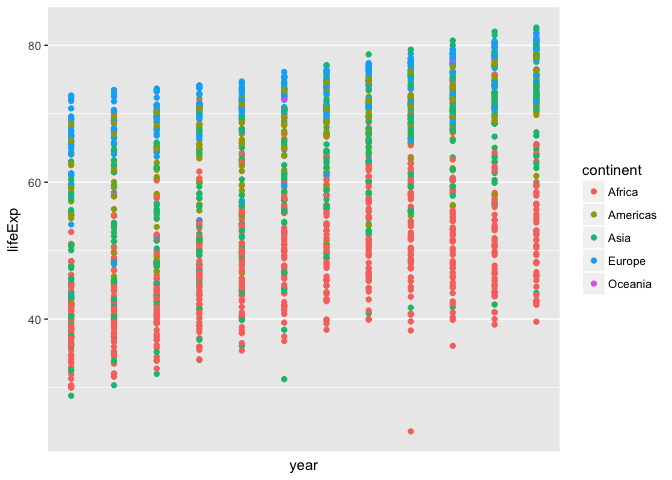<!-- -->

After finding some additional notes re making fancy scatterplots, I want to add 


```r
p + geom_point() + scale_x_log10() # transforms the scatterplot to log scale
```

```
## Scale for 'x' is already present. Adding another scale for 'x', which
## will replace the existing scale.
```

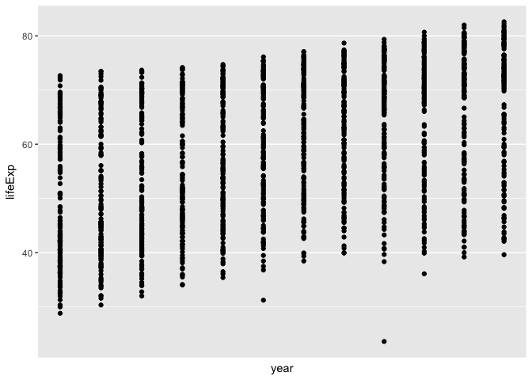<!-- -->

```r
p <- p + scale_x_log10() # re-defining 'p' to integrate the transformation
```

```
## Scale for 'x' is already present. Adding another scale for 'x', which
## will replace the existing scale.
```

```r
p <- p + aes(color = continent) + geom_point() + geom_smooth(lwd = 3, se = FALSE)
p + ggtitle("Life expectancy over time by continent") # adding a title (not sure why left justified)
```

```
## `geom_smooth()` using method = 'loess'
```

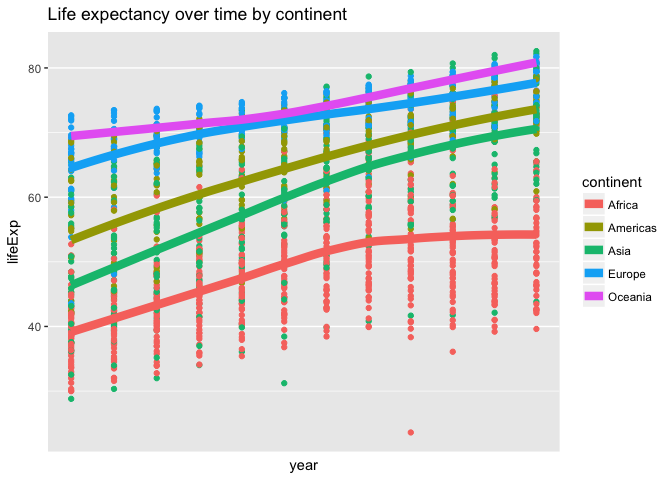<!-- -->

#### Bar charts


```r
ggplot(gapminder, aes(x = continent)) + geom_bar()
```

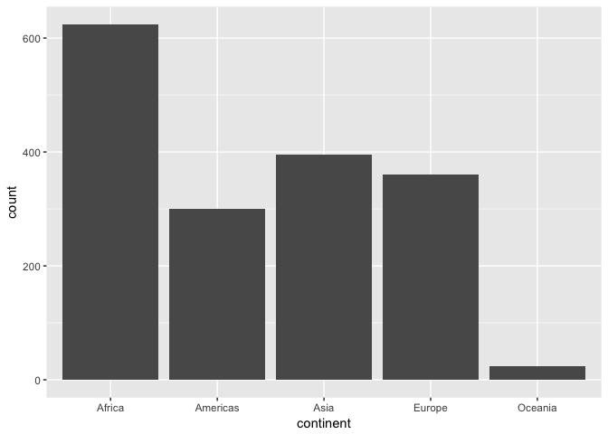<!-- -->

#### Density plot


```r
ggplot(subset(gapminder, continent != "Oceania"), #removing Oceania to simplify because only 2 countries...
              aes(x = lifeExp, color = continent)) + geom_density()
```

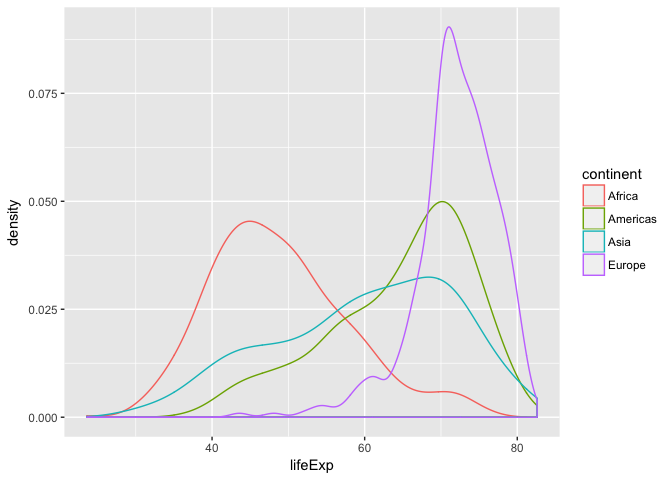<!-- -->

#### Boxplots (1 categorical, 1 quantitative)


```r
ggplot(gapminder, aes(x = continent, y = lifeExp)) + geom_boxplot(aes(colour=continent))
```

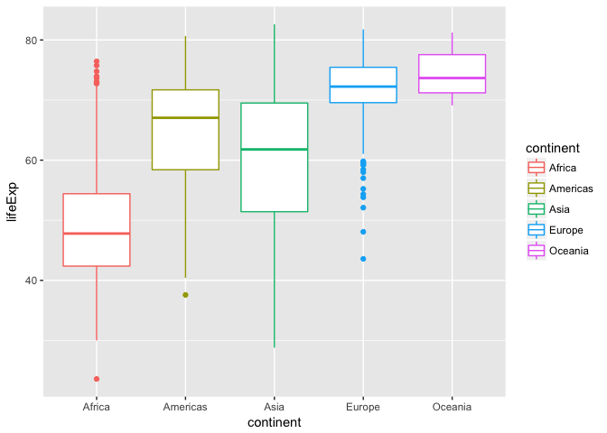<!-- -->


## Using `filter()` and `select()`

I recently listened to a podcast about gender equity and political changes post-genocide in Rwanda. As such, I'd like to have  a closer look at gdpPercap and lifeExp in Rwanda chronologically. First I'll use the ```filter``` function to pull up the data from Rwanda and see what we're working with.


```r
filter(gapminder, country=="Rwanda")
```

```
## # A tibble: 12 x 6
##    country continent  year lifeExp     pop gdpPercap
##     <fctr>    <fctr> <int>   <dbl>   <int>     <dbl>
##  1  Rwanda    Africa  1952  40.000 2534927  493.3239
##  2  Rwanda    Africa  1957  41.500 2822082  540.2894
##  3  Rwanda    Africa  1962  43.000 3051242  597.4731
##  4  Rwanda    Africa  1967  44.100 3451079  510.9637
##  5  Rwanda    Africa  1972  44.600 3992121  590.5807
##  6  Rwanda    Africa  1977  45.000 4657072  670.0806
##  7  Rwanda    Africa  1982  46.218 5507565  881.5706
##  8  Rwanda    Africa  1987  44.020 6349365  847.9912
##  9  Rwanda    Africa  1992  23.599 7290203  737.0686
## 10  Rwanda    Africa  1997  36.087 7212583  589.9445
## 11  Rwanda    Africa  2002  43.413 7852401  785.6538
## 12  Rwanda    Africa  2007  46.242 8860588  863.0885
```

Now, I'll use the filter function and piping to make a scatterplot of these variables over time. 


```r
gapminder %>% 
  filter(country == "Rwanda") %>%
ggplot(aes(x = year, y = lifeExp)) + 
   geom_point() + # no need for alpha transparency
  geom_smooth(se=FALSE) #removing standard error and allowing for curvy line
```

```
## `geom_smooth()` using method = 'loess'
```

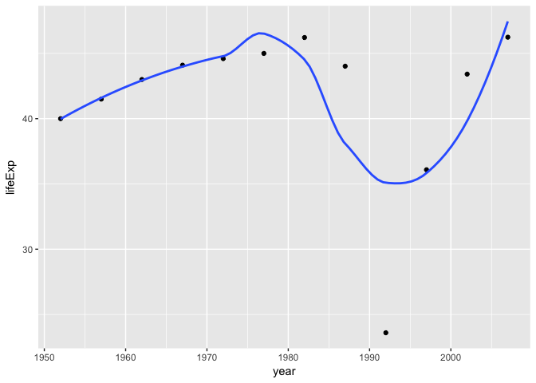<!-- -->

It might be interesting to look at several countries in Africa during a smaller subset of years...


```r
gapminder %>%
  filter(continent == "Africa", year >= 1970) %>%
  ggplot(aes(year, lifeExp, group=country, colour=country))
```

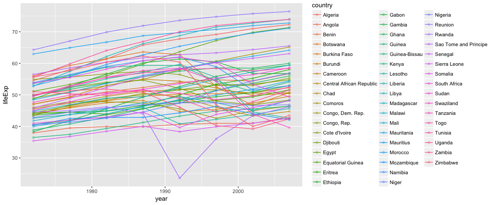<!-- -->

```r
  geom_line(alpha=0.2)
```

```
## geom_line: na.rm = FALSE
## stat_identity: na.rm = FALSE
## position_identity
```

Then maybe it would be nice to take a look at a few coutries that may show interesting temporal changes in life expectancy. To do this I'd like to call up the data for 4 countries from 4 different continents, and take a closer look at some years more recently...


```r
gapminder %>% 
    filter(country %in% c("Rwanda", "Afghanistan", "Haiti", "Ireland"), 
           year >= 1970) %>% 
    select(country, year, lifeExp)
```

```
## # A tibble: 32 x 3
##        country  year lifeExp
##         <fctr> <int>   <dbl>
##  1 Afghanistan  1972  36.088
##  2 Afghanistan  1977  38.438
##  3 Afghanistan  1982  39.854
##  4 Afghanistan  1987  40.822
##  5 Afghanistan  1992  41.674
##  6 Afghanistan  1997  41.763
##  7 Afghanistan  2002  42.129
##  8 Afghanistan  2007  43.828
##  9       Haiti  1972  48.042
## 10       Haiti  1977  49.923
## # ... with 22 more rows
```

Now we can look at these changes for each country over time graphically using the ggplot functions.


```r
gapminder %>% 
    filter(country %in% c("Rwanda", "Afghanistan", "Haiti", "Ireland")) %>% 
  ggplot(aes(year, lifeExp, colour=continent)) +
  geom_point() +
  geom_line()
```

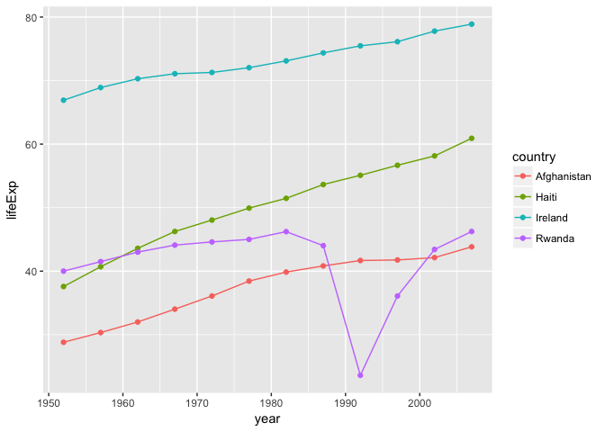<!-- -->


