# hw02


```r
#+ setup, include = FALSE
library(knitr)
opts_chunk$set(fig.path = 'figure/scatterplot-', error = TRUE)
```


Fisrt, I'll call up the gapminder dataset and tidyverse package (meta-package that contains dplyr - what we are actually interested in).


```r
library(gapminder)
library(tidyverse)
```

```
## Loading tidyverse: ggplot2
## Loading tidyverse: tibble
## Loading tidyverse: tidyr
## Loading tidyverse: readr
## Loading tidyverse: purrr
## Loading tidyverse: dplyr
```

```
## Conflicts with tidy packages ----------------------------------------------
```

```
## filter(): dplyr, stats
## lag():    dplyr, stats
```

## 1. Exploring the data

#### 1.1 Dataset type/class

One of the first questions to ask when working with a new dataset would be, what kind of form/structure does this dataset have? 

Because I have just done some reading about ```dplyr```, I assume (and know from previous assignments) that this is a dataframe, but if I wanted to confirm I could just call up the dataset to see a nicely formatted snippet of the rows and columns and what it is:


```r
gapminder
```

```
## # A tibble: 1,704 x 6
##        country continent  year lifeExp      pop gdpPercap
##         <fctr>    <fctr> <int>   <dbl>    <int>     <dbl>
##  1 Afghanistan      Asia  1952  28.801  8425333  779.4453
##  2 Afghanistan      Asia  1957  30.332  9240934  820.8530
##  3 Afghanistan      Asia  1962  31.997 10267083  853.1007
##  4 Afghanistan      Asia  1967  34.020 11537966  836.1971
##  5 Afghanistan      Asia  1972  36.088 13079460  739.9811
##  6 Afghanistan      Asia  1977  38.438 14880372  786.1134
##  7 Afghanistan      Asia  1982  39.854 12881816  978.0114
##  8 Afghanistan      Asia  1987  40.822 13867957  852.3959
##  9 Afghanistan      Asia  1992  41.674 16317921  649.3414
## 10 Afghanistan      Asia  1997  41.763 22227415  635.3414
## # ... with 1,694 more rows
```

Thanks to the tidyverse meta-package, this comes back as a nicely formatted tibble, and confirms we are working with a dataframe.

I can also use the ```typeof``` command to see the type or storage model of the object. This comes back as a ```list```. Upon investigating further and recalling info from previous classes, I can conclude that the gapminder dataset is both a list and a dataframe (a specific type of list). Some more info can be found here: https://stackoverflow.com/questions/15901224/what-is-difference-between-dataframe-and-list-in-r


```r
typeof(gapminder)
```

```
## [1] "list"
```


We can can also use the ```class``` command to see what type of data we are working with:


```r
class(gapminder)
```

```
## [1] "tbl_df"     "tbl"        "data.frame"
```

This command confirms that we are working with a table/dataframe. 

#### 1.2 Dataset size & extent

To find out how many **columns**/variables, we simply use the ```ncol``` command, and similarly for the number of **rows**/observations


```r
ncol(gapminder)
```

```
## [1] 6
```

```r
nrow(gapminder)
```

```
## [1] 1704
```

Another way to get this information all at once (with one command) is the use the ```summarize``` function, but this requires some counting and deciphering to get the same information :


```r
summary(gapminder)
```

```
##         country        continent        year         lifeExp     
##  Afghanistan:  12   Africa  :624   Min.   :1952   Min.   :23.60  
##  Albania    :  12   Americas:300   1st Qu.:1966   1st Qu.:48.20  
##  Algeria    :  12   Asia    :396   Median :1980   Median :60.71  
##  Angola     :  12   Europe  :360   Mean   :1980   Mean   :59.47  
##  Argentina  :  12   Oceania : 24   3rd Qu.:1993   3rd Qu.:70.85  
##  Australia  :  12                  Max.   :2007   Max.   :82.60  
##  (Other)    :1632                                                
##       pop              gdpPercap       
##  Min.   :6.001e+04   Min.   :   241.2  
##  1st Qu.:2.794e+06   1st Qu.:  1202.1  
##  Median :7.024e+06   Median :  3531.8  
##  Mean   :2.960e+07   Mean   :  7215.3  
##  3rd Qu.:1.959e+07   3rd Qu.:  9325.5  
##  Max.   :1.319e+09   Max.   :113523.1  
## 
```

However, if you really want quick and specific information about the data, using the discrete commands such as ```ncol``` and ```nrow``` could be helpful. 

#### 1.3 Variable types

To isolate one variable in the data frame, you use the $ sign. We can write code to tell us each variable type individually. The following commands tell us that each variable is an integer, apart from ```lifeExp``` and ```gdpPercap```.


```r
typeof(gapminder$country)
```

```
## [1] "integer"
```

```r
typeof(gapminder$continent)
```

```
## [1] "integer"
```

```r
typeof(gapminder$year)
```

```
## [1] "integer"
```

```r
typeof(gapminder$lifeExp)
```

```
## [1] "double"
```

```r
typeof(gapminder$pop)
```

```
## [1] "integer"
```

```r
typeof(gapminder$gdpPercap)
```

```
## [1] "double"
```

## 2. Investigate individual variables

I'd like to take a closer look at lifeExp (quantitative - double) by country (categorical - integer type).

#### 2.1 Possible values and range

First I'll look at the possible values for each category, starting with the possible entries for country. I can use ```levels``` to call up the full list of countries in the dataset, and ```nlevels``` to see the number of possible countries. I won't type the full list, but there are 142 countries in this dataset!


```r
levels(gapminder$country)
```

```
##   [1] "Afghanistan"              "Albania"                 
##   [3] "Algeria"                  "Angola"                  
##   [5] "Argentina"                "Australia"               
##   [7] "Austria"                  "Bahrain"                 
##   [9] "Bangladesh"               "Belgium"                 
##  [11] "Benin"                    "Bolivia"                 
##  [13] "Bosnia and Herzegovina"   "Botswana"                
##  [15] "Brazil"                   "Bulgaria"                
##  [17] "Burkina Faso"             "Burundi"                 
##  [19] "Cambodia"                 "Cameroon"                
##  [21] "Canada"                   "Central African Republic"
##  [23] "Chad"                     "Chile"                   
##  [25] "China"                    "Colombia"                
##  [27] "Comoros"                  "Congo, Dem. Rep."        
##  [29] "Congo, Rep."              "Costa Rica"              
##  [31] "Cote d'Ivoire"            "Croatia"                 
##  [33] "Cuba"                     "Czech Republic"          
##  [35] "Denmark"                  "Djibouti"                
##  [37] "Dominican Republic"       "Ecuador"                 
##  [39] "Egypt"                    "El Salvador"             
##  [41] "Equatorial Guinea"        "Eritrea"                 
##  [43] "Ethiopia"                 "Finland"                 
##  [45] "France"                   "Gabon"                   
##  [47] "Gambia"                   "Germany"                 
##  [49] "Ghana"                    "Greece"                  
##  [51] "Guatemala"                "Guinea"                  
##  [53] "Guinea-Bissau"            "Haiti"                   
##  [55] "Honduras"                 "Hong Kong, China"        
##  [57] "Hungary"                  "Iceland"                 
##  [59] "India"                    "Indonesia"               
##  [61] "Iran"                     "Iraq"                    
##  [63] "Ireland"                  "Israel"                  
##  [65] "Italy"                    "Jamaica"                 
##  [67] "Japan"                    "Jordan"                  
##  [69] "Kenya"                    "Korea, Dem. Rep."        
##  [71] "Korea, Rep."              "Kuwait"                  
##  [73] "Lebanon"                  "Lesotho"                 
##  [75] "Liberia"                  "Libya"                   
##  [77] "Madagascar"               "Malawi"                  
##  [79] "Malaysia"                 "Mali"                    
##  [81] "Mauritania"               "Mauritius"               
##  [83] "Mexico"                   "Mongolia"                
##  [85] "Montenegro"               "Morocco"                 
##  [87] "Mozambique"               "Myanmar"                 
##  [89] "Namibia"                  "Nepal"                   
##  [91] "Netherlands"              "New Zealand"             
##  [93] "Nicaragua"                "Niger"                   
##  [95] "Nigeria"                  "Norway"                  
##  [97] "Oman"                     "Pakistan"                
##  [99] "Panama"                   "Paraguay"                
## [101] "Peru"                     "Philippines"             
## [103] "Poland"                   "Portugal"                
## [105] "Puerto Rico"              "Reunion"                 
## [107] "Romania"                  "Rwanda"                  
## [109] "Sao Tome and Principe"    "Saudi Arabia"            
## [111] "Senegal"                  "Serbia"                  
## [113] "Sierra Leone"             "Singapore"               
## [115] "Slovak Republic"          "Slovenia"                
## [117] "Somalia"                  "South Africa"            
## [119] "Spain"                    "Sri Lanka"               
## [121] "Sudan"                    "Swaziland"               
## [123] "Sweden"                   "Switzerland"             
## [125] "Syria"                    "Taiwan"                  
## [127] "Tanzania"                 "Thailand"                
## [129] "Togo"                     "Trinidad and Tobago"     
## [131] "Tunisia"                  "Turkey"                  
## [133] "Uganda"                   "United Kingdom"          
## [135] "United States"            "Uruguay"                 
## [137] "Venezuela"                "Vietnam"                 
## [139] "West Bank and Gaza"       "Yemen, Rep."             
## [141] "Zambia"                   "Zimbabwe"
```

```r
nlevels(gapminder$country)
```

```
## [1] 142
```

OK now let's do that for our quantitative (double) variable - ```lifeExp```. Because we can summarize the range of this variable numerically, we will do this diffently. 


```r
summary(gapminder$lifeExp)
```

```
##    Min. 1st Qu.  Median    Mean 3rd Qu.    Max. 
##   23.60   48.20   60.71   59.47   70.85   82.60
```

The summary function gives us the minimum value (23.60), the maximum value (82.60), as well as the median and the mean. 

#### 2.2 Spread and distribution 

I cannot make a histogram of country to see the distribution because it is not numeric, however, I can use the ```table``` command to build a contingency table of the counts for each country entry.


```r
table(gapminder$country)
```

```
## 
##              Afghanistan                  Albania                  Algeria 
##                       12                       12                       12 
##                   Angola                Argentina                Australia 
##                       12                       12                       12 
##                  Austria                  Bahrain               Bangladesh 
##                       12                       12                       12 
##                  Belgium                    Benin                  Bolivia 
##                       12                       12                       12 
##   Bosnia and Herzegovina                 Botswana                   Brazil 
##                       12                       12                       12 
##                 Bulgaria             Burkina Faso                  Burundi 
##                       12                       12                       12 
##                 Cambodia                 Cameroon                   Canada 
##                       12                       12                       12 
## Central African Republic                     Chad                    Chile 
##                       12                       12                       12 
##                    China                 Colombia                  Comoros 
##                       12                       12                       12 
##         Congo, Dem. Rep.              Congo, Rep.               Costa Rica 
##                       12                       12                       12 
##            Cote d'Ivoire                  Croatia                     Cuba 
##                       12                       12                       12 
##           Czech Republic                  Denmark                 Djibouti 
##                       12                       12                       12 
##       Dominican Republic                  Ecuador                    Egypt 
##                       12                       12                       12 
##              El Salvador        Equatorial Guinea                  Eritrea 
##                       12                       12                       12 
##                 Ethiopia                  Finland                   France 
##                       12                       12                       12 
##                    Gabon                   Gambia                  Germany 
##                       12                       12                       12 
##                    Ghana                   Greece                Guatemala 
##                       12                       12                       12 
##                   Guinea            Guinea-Bissau                    Haiti 
##                       12                       12                       12 
##                 Honduras         Hong Kong, China                  Hungary 
##                       12                       12                       12 
##                  Iceland                    India                Indonesia 
##                       12                       12                       12 
##                     Iran                     Iraq                  Ireland 
##                       12                       12                       12 
##                   Israel                    Italy                  Jamaica 
##                       12                       12                       12 
##                    Japan                   Jordan                    Kenya 
##                       12                       12                       12 
##         Korea, Dem. Rep.              Korea, Rep.                   Kuwait 
##                       12                       12                       12 
##                  Lebanon                  Lesotho                  Liberia 
##                       12                       12                       12 
##                    Libya               Madagascar                   Malawi 
##                       12                       12                       12 
##                 Malaysia                     Mali               Mauritania 
##                       12                       12                       12 
##                Mauritius                   Mexico                 Mongolia 
##                       12                       12                       12 
##               Montenegro                  Morocco               Mozambique 
##                       12                       12                       12 
##                  Myanmar                  Namibia                    Nepal 
##                       12                       12                       12 
##              Netherlands              New Zealand                Nicaragua 
##                       12                       12                       12 
##                    Niger                  Nigeria                   Norway 
##                       12                       12                       12 
##                     Oman                 Pakistan                   Panama 
##                       12                       12                       12 
##                 Paraguay                     Peru              Philippines 
##                       12                       12                       12 
##                   Poland                 Portugal              Puerto Rico 
##                       12                       12                       12 
##                  Reunion                  Romania                   Rwanda 
##                       12                       12                       12 
##    Sao Tome and Principe             Saudi Arabia                  Senegal 
##                       12                       12                       12 
##                   Serbia             Sierra Leone                Singapore 
##                       12                       12                       12 
##          Slovak Republic                 Slovenia                  Somalia 
##                       12                       12                       12 
##             South Africa                    Spain                Sri Lanka 
##                       12                       12                       12 
##                    Sudan                Swaziland                   Sweden 
##                       12                       12                       12 
##              Switzerland                    Syria                   Taiwan 
##                       12                       12                       12 
##                 Tanzania                 Thailand                     Togo 
##                       12                       12                       12 
##      Trinidad and Tobago                  Tunisia                   Turkey 
##                       12                       12                       12 
##                   Uganda           United Kingdom            United States 
##                       12                       12                       12 
##                  Uruguay                Venezuela                  Vietnam 
##                       12                       12                       12 
##       West Bank and Gaza              Yemen, Rep.                   Zambia 
##                       12                       12                       12 
##                 Zimbabwe 
##                       12
```

This shows me that there are 12 entries for each country, which should each correspond to a year in the series. For fun, I will confirm this assumption...


```r
list(gapminder$year)
```

```
## [[1]]
##    [1] 1952 1957 1962 1967 1972 1977 1982 1987 1992 1997 2002 2007 1952
##   [14] 1957 1962 1967 1972 1977 1982 1987 1992 1997 2002 2007 1952 1957
##   [27] 1962 1967 1972 1977 1982 1987 1992 1997 2002 2007 1952 1957 1962
##   [40] 1967 1972 1977 1982 1987 1992 1997 2002 2007 1952 1957 1962 1967
##   [53] 1972 1977 1982 1987 1992 1997 2002 2007 1952 1957 1962 1967 1972
##   [66] 1977 1982 1987 1992 1997 2002 2007 1952 1957 1962 1967 1972 1977
##   [79] 1982 1987 1992 1997 2002 2007 1952 1957 1962 1967 1972 1977 1982
##   [92] 1987 1992 1997 2002 2007 1952 1957 1962 1967 1972 1977 1982 1987
##  [105] 1992 1997 2002 2007 1952 1957 1962 1967 1972 1977 1982 1987 1992
##  [118] 1997 2002 2007 1952 1957 1962 1967 1972 1977 1982 1987 1992 1997
##  [131] 2002 2007 1952 1957 1962 1967 1972 1977 1982 1987 1992 1997 2002
##  [144] 2007 1952 1957 1962 1967 1972 1977 1982 1987 1992 1997 2002 2007
##  [157] 1952 1957 1962 1967 1972 1977 1982 1987 1992 1997 2002 2007 1952
##  [170] 1957 1962 1967 1972 1977 1982 1987 1992 1997 2002 2007 1952 1957
##  [183] 1962 1967 1972 1977 1982 1987 1992 1997 2002 2007 1952 1957 1962
##  [196] 1967 1972 1977 1982 1987 1992 1997 2002 2007 1952 1957 1962 1967
##  [209] 1972 1977 1982 1987 1992 1997 2002 2007 1952 1957 1962 1967 1972
##  [222] 1977 1982 1987 1992 1997 2002 2007 1952 1957 1962 1967 1972 1977
##  [235] 1982 1987 1992 1997 2002 2007 1952 1957 1962 1967 1972 1977 1982
##  [248] 1987 1992 1997 2002 2007 1952 1957 1962 1967 1972 1977 1982 1987
##  [261] 1992 1997 2002 2007 1952 1957 1962 1967 1972 1977 1982 1987 1992
##  [274] 1997 2002 2007 1952 1957 1962 1967 1972 1977 1982 1987 1992 1997
##  [287] 2002 2007 1952 1957 1962 1967 1972 1977 1982 1987 1992 1997 2002
##  [300] 2007 1952 1957 1962 1967 1972 1977 1982 1987 1992 1997 2002 2007
##  [313] 1952 1957 1962 1967 1972 1977 1982 1987 1992 1997 2002 2007 1952
##  [326] 1957 1962 1967 1972 1977 1982 1987 1992 1997 2002 2007 1952 1957
##  [339] 1962 1967 1972 1977 1982 1987 1992 1997 2002 2007 1952 1957 1962
##  [352] 1967 1972 1977 1982 1987 1992 1997 2002 2007 1952 1957 1962 1967
##  [365] 1972 1977 1982 1987 1992 1997 2002 2007 1952 1957 1962 1967 1972
##  [378] 1977 1982 1987 1992 1997 2002 2007 1952 1957 1962 1967 1972 1977
##  [391] 1982 1987 1992 1997 2002 2007 1952 1957 1962 1967 1972 1977 1982
##  [404] 1987 1992 1997 2002 2007 1952 1957 1962 1967 1972 1977 1982 1987
##  [417] 1992 1997 2002 2007 1952 1957 1962 1967 1972 1977 1982 1987 1992
##  [430] 1997 2002 2007 1952 1957 1962 1967 1972 1977 1982 1987 1992 1997
##  [443] 2002 2007 1952 1957 1962 1967 1972 1977 1982 1987 1992 1997 2002
##  [456] 2007 1952 1957 1962 1967 1972 1977 1982 1987 1992 1997 2002 2007
##  [469] 1952 1957 1962 1967 1972 1977 1982 1987 1992 1997 2002 2007 1952
##  [482] 1957 1962 1967 1972 1977 1982 1987 1992 1997 2002 2007 1952 1957
##  [495] 1962 1967 1972 1977 1982 1987 1992 1997 2002 2007 1952 1957 1962
##  [508] 1967 1972 1977 1982 1987 1992 1997 2002 2007 1952 1957 1962 1967
##  [521] 1972 1977 1982 1987 1992 1997 2002 2007 1952 1957 1962 1967 1972
##  [534] 1977 1982 1987 1992 1997 2002 2007 1952 1957 1962 1967 1972 1977
##  [547] 1982 1987 1992 1997 2002 2007 1952 1957 1962 1967 1972 1977 1982
##  [560] 1987 1992 1997 2002 2007 1952 1957 1962 1967 1972 1977 1982 1987
##  [573] 1992 1997 2002 2007 1952 1957 1962 1967 1972 1977 1982 1987 1992
##  [586] 1997 2002 2007 1952 1957 1962 1967 1972 1977 1982 1987 1992 1997
##  [599] 2002 2007 1952 1957 1962 1967 1972 1977 1982 1987 1992 1997 2002
##  [612] 2007 1952 1957 1962 1967 1972 1977 1982 1987 1992 1997 2002 2007
##  [625] 1952 1957 1962 1967 1972 1977 1982 1987 1992 1997 2002 2007 1952
##  [638] 1957 1962 1967 1972 1977 1982 1987 1992 1997 2002 2007 1952 1957
##  [651] 1962 1967 1972 1977 1982 1987 1992 1997 2002 2007 1952 1957 1962
##  [664] 1967 1972 1977 1982 1987 1992 1997 2002 2007 1952 1957 1962 1967
##  [677] 1972 1977 1982 1987 1992 1997 2002 2007 1952 1957 1962 1967 1972
##  [690] 1977 1982 1987 1992 1997 2002 2007 1952 1957 1962 1967 1972 1977
##  [703] 1982 1987 1992 1997 2002 2007 1952 1957 1962 1967 1972 1977 1982
##  [716] 1987 1992 1997 2002 2007 1952 1957 1962 1967 1972 1977 1982 1987
##  [729] 1992 1997 2002 2007 1952 1957 1962 1967 1972 1977 1982 1987 1992
##  [742] 1997 2002 2007 1952 1957 1962 1967 1972 1977 1982 1987 1992 1997
##  [755] 2002 2007 1952 1957 1962 1967 1972 1977 1982 1987 1992 1997 2002
##  [768] 2007 1952 1957 1962 1967 1972 1977 1982 1987 1992 1997 2002 2007
##  [781] 1952 1957 1962 1967 1972 1977 1982 1987 1992 1997 2002 2007 1952
##  [794] 1957 1962 1967 1972 1977 1982 1987 1992 1997 2002 2007 1952 1957
##  [807] 1962 1967 1972 1977 1982 1987 1992 1997 2002 2007 1952 1957 1962
##  [820] 1967 1972 1977 1982 1987 1992 1997 2002 2007 1952 1957 1962 1967
##  [833] 1972 1977 1982 1987 1992 1997 2002 2007 1952 1957 1962 1967 1972
##  [846] 1977 1982 1987 1992 1997 2002 2007 1952 1957 1962 1967 1972 1977
##  [859] 1982 1987 1992 1997 2002 2007 1952 1957 1962 1967 1972 1977 1982
##  [872] 1987 1992 1997 2002 2007 1952 1957 1962 1967 1972 1977 1982 1987
##  [885] 1992 1997 2002 2007 1952 1957 1962 1967 1972 1977 1982 1987 1992
##  [898] 1997 2002 2007 1952 1957 1962 1967 1972 1977 1982 1987 1992 1997
##  [911] 2002 2007 1952 1957 1962 1967 1972 1977 1982 1987 1992 1997 2002
##  [924] 2007 1952 1957 1962 1967 1972 1977 1982 1987 1992 1997 2002 2007
##  [937] 1952 1957 1962 1967 1972 1977 1982 1987 1992 1997 2002 2007 1952
##  [950] 1957 1962 1967 1972 1977 1982 1987 1992 1997 2002 2007 1952 1957
##  [963] 1962 1967 1972 1977 1982 1987 1992 1997 2002 2007 1952 1957 1962
##  [976] 1967 1972 1977 1982 1987 1992 1997 2002 2007 1952 1957 1962 1967
##  [989] 1972 1977 1982 1987 1992 1997 2002 2007 1952 1957 1962 1967 1972
## [1002] 1977 1982 1987 1992 1997 2002 2007 1952 1957 1962 1967 1972 1977
## [1015] 1982 1987 1992 1997 2002 2007 1952 1957 1962 1967 1972 1977 1982
## [1028] 1987 1992 1997 2002 2007 1952 1957 1962 1967 1972 1977 1982 1987
## [1041] 1992 1997 2002 2007 1952 1957 1962 1967 1972 1977 1982 1987 1992
## [1054] 1997 2002 2007 1952 1957 1962 1967 1972 1977 1982 1987 1992 1997
## [1067] 2002 2007 1952 1957 1962 1967 1972 1977 1982 1987 1992 1997 2002
## [1080] 2007 1952 1957 1962 1967 1972 1977 1982 1987 1992 1997 2002 2007
## [1093] 1952 1957 1962 1967 1972 1977 1982 1987 1992 1997 2002 2007 1952
## [1106] 1957 1962 1967 1972 1977 1982 1987 1992 1997 2002 2007 1952 1957
## [1119] 1962 1967 1972 1977 1982 1987 1992 1997 2002 2007 1952 1957 1962
## [1132] 1967 1972 1977 1982 1987 1992 1997 2002 2007 1952 1957 1962 1967
## [1145] 1972 1977 1982 1987 1992 1997 2002 2007 1952 1957 1962 1967 1972
## [1158] 1977 1982 1987 1992 1997 2002 2007 1952 1957 1962 1967 1972 1977
## [1171] 1982 1987 1992 1997 2002 2007 1952 1957 1962 1967 1972 1977 1982
## [1184] 1987 1992 1997 2002 2007 1952 1957 1962 1967 1972 1977 1982 1987
## [1197] 1992 1997 2002 2007 1952 1957 1962 1967 1972 1977 1982 1987 1992
## [1210] 1997 2002 2007 1952 1957 1962 1967 1972 1977 1982 1987 1992 1997
## [1223] 2002 2007 1952 1957 1962 1967 1972 1977 1982 1987 1992 1997 2002
## [1236] 2007 1952 1957 1962 1967 1972 1977 1982 1987 1992 1997 2002 2007
## [1249] 1952 1957 1962 1967 1972 1977 1982 1987 1992 1997 2002 2007 1952
## [1262] 1957 1962 1967 1972 1977 1982 1987 1992 1997 2002 2007 1952 1957
## [1275] 1962 1967 1972 1977 1982 1987 1992 1997 2002 2007 1952 1957 1962
## [1288] 1967 1972 1977 1982 1987 1992 1997 2002 2007 1952 1957 1962 1967
## [1301] 1972 1977 1982 1987 1992 1997 2002 2007 1952 1957 1962 1967 1972
## [1314] 1977 1982 1987 1992 1997 2002 2007 1952 1957 1962 1967 1972 1977
## [1327] 1982 1987 1992 1997 2002 2007 1952 1957 1962 1967 1972 1977 1982
## [1340] 1987 1992 1997 2002 2007 1952 1957 1962 1967 1972 1977 1982 1987
## [1353] 1992 1997 2002 2007 1952 1957 1962 1967 1972 1977 1982 1987 1992
## [1366] 1997 2002 2007 1952 1957 1962 1967 1972 1977 1982 1987 1992 1997
## [1379] 2002 2007 1952 1957 1962 1967 1972 1977 1982 1987 1992 1997 2002
## [1392] 2007 1952 1957 1962 1967 1972 1977 1982 1987 1992 1997 2002 2007
## [1405] 1952 1957 1962 1967 1972 1977 1982 1987 1992 1997 2002 2007 1952
## [1418] 1957 1962 1967 1972 1977 1982 1987 1992 1997 2002 2007 1952 1957
## [1431] 1962 1967 1972 1977 1982 1987 1992 1997 2002 2007 1952 1957 1962
## [1444] 1967 1972 1977 1982 1987 1992 1997 2002 2007 1952 1957 1962 1967
## [1457] 1972 1977 1982 1987 1992 1997 2002 2007 1952 1957 1962 1967 1972
## [1470] 1977 1982 1987 1992 1997 2002 2007 1952 1957 1962 1967 1972 1977
## [1483] 1982 1987 1992 1997 2002 2007 1952 1957 1962 1967 1972 1977 1982
## [1496] 1987 1992 1997 2002 2007 1952 1957 1962 1967 1972 1977 1982 1987
## [1509] 1992 1997 2002 2007 1952 1957 1962 1967 1972 1977 1982 1987 1992
## [1522] 1997 2002 2007 1952 1957 1962 1967 1972 1977 1982 1987 1992 1997
## [1535] 2002 2007 1952 1957 1962 1967 1972 1977 1982 1987 1992 1997 2002
## [1548] 2007 1952 1957 1962 1967 1972 1977 1982 1987 1992 1997 2002 2007
## [1561] 1952 1957 1962 1967 1972 1977 1982 1987 1992 1997 2002 2007 1952
## [1574] 1957 1962 1967 1972 1977 1982 1987 1992 1997 2002 2007 1952 1957
## [1587] 1962 1967 1972 1977 1982 1987 1992 1997 2002 2007 1952 1957 1962
## [1600] 1967 1972 1977 1982 1987 1992 1997 2002 2007 1952 1957 1962 1967
## [1613] 1972 1977 1982 1987 1992 1997 2002 2007 1952 1957 1962 1967 1972
## [1626] 1977 1982 1987 1992 1997 2002 2007 1952 1957 1962 1967 1972 1977
## [1639] 1982 1987 1992 1997 2002 2007 1952 1957 1962 1967 1972 1977 1982
## [1652] 1987 1992 1997 2002 2007 1952 1957 1962 1967 1972 1977 1982 1987
## [1665] 1992 1997 2002 2007 1952 1957 1962 1967 1972 1977 1982 1987 1992
## [1678] 1997 2002 2007 1952 1957 1962 1967 1972 1977 1982 1987 1992 1997
## [1691] 2002 2007 1952 1957 1962 1967 1972 1977 1982 1987 1992 1997 2002
## [1704] 2007
```

Though not the most elegant way of doing it, this confirms that there are 12 unique rows of data for each country, corresponding to distinct years.

Though a bit silly, we can also see this by making a histogram of ```year``` (12 values all with an equal frequency).


```r
hist(gapminder$year)
```

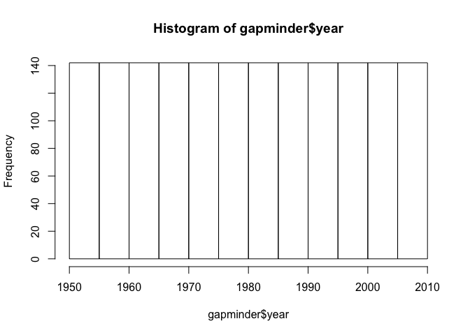<!-- -->

Now let's look at the spread or distribution of ```lifeExp``` - only let's do it visually using a histogram. I've gone ahead and looked up some formatting and added lines of central tendency so we can view these values on the histogram (and a legend to explain what they are!).


```r
hist(gapminder$lifeExp,
     col = "peachpuff", # now I am really curious to know what other colour options there are...
     border = "black")
abline(v = mean(gapminder$lifeExp), # adding lines for central tendency
	col = "royalblue",
	lwd = 2)
abline(v = median(gapminder$lifeExp),
	col = "red",
	lwd = 2)
legend(x = "topright", # location of legend within plot area
	c("Mean", "Median"),
	col = c("royalblue", "red"),
lwd = c( 2, 2))
```

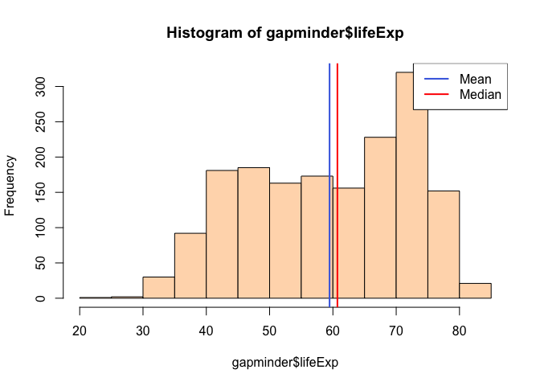<!-- -->

This allows us to see quite quickly that the histogram is slightly skewed to the left, as there are many entries/rows of data with values between 70 and 75. Using the ```summary``` function we can call up the precise values of the median (60.71), which is slightly higher than the mean (59.47). 


```r
summary(gapminder$lifeExp)
```

```
##    Min. 1st Qu.  Median    Mean 3rd Qu.    Max. 
##   23.60   48.20   60.71   59.47   70.85   82.60
```

## 3. Exploring various plot types

#### 3.1 Scatterplots


```r
ggplot(gapminder, aes(x = year, y = lifeExp)) # This just sets up the axes by assigning variables -- links certain scale to geometric object
```

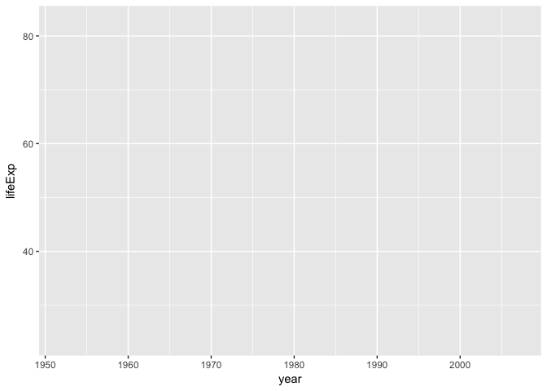<!-- -->

```r
ggplot(gapminder, aes(x = year, y = lifeExp)) + #adding the geom_point sets up the relationship for the scatterplot
  geom_point()
```

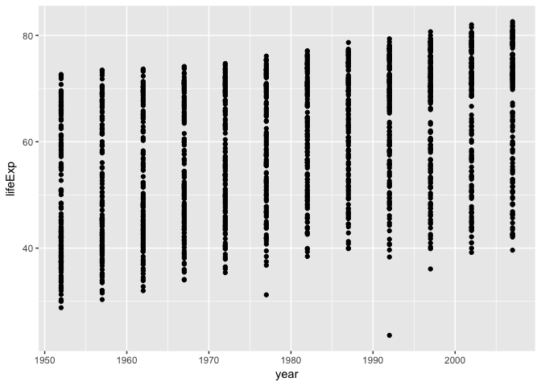<!-- -->

```r
p <- ggplot(gapminder, aes(x = year, y = lifeExp)) # this initializes the scatterplot
```

Let's also look at a scatterplot by two continuous variables to give us the full 'scatter' effect...


```r
ggplot(gapminder, aes(x = gdpPercap, y = lifeExp)) 
```

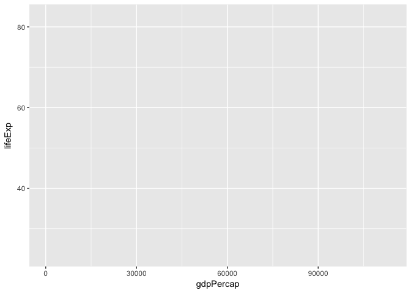<!-- -->

```r
ggplot(gapminder, aes(x = gdpPercap, y = lifeExp)) + 
  geom_point()
```

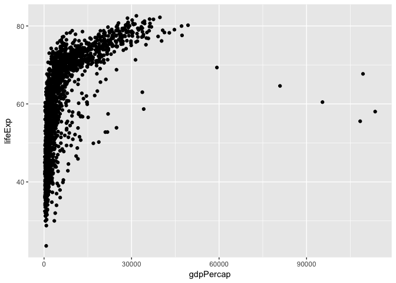<!-- -->
Let's make that scatterplot a bit more visually appealing...


```r
p + geom_point() + scale_x_log10() # transforms the scatterplot to log scale
```

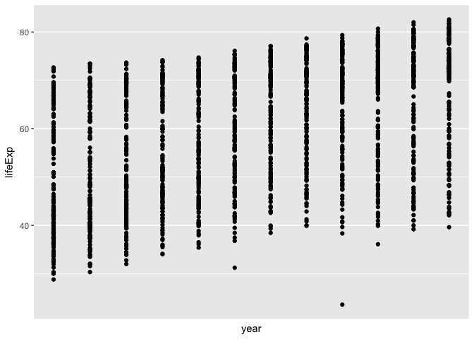<!-- -->

```r
p <- p + scale_x_log10() # re-defining 'p' to integrate the transformation
p + geom_point(aes(color = continent)) # adding colur based on continent
```

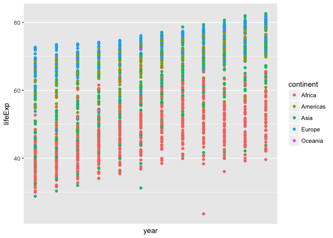<!-- -->

After finding some additional notes re making fancy scatterplots, I want to add 


```r
p + geom_point() + scale_x_log10() # transforms the scatterplot to log scale
```

```
## Scale for 'x' is already present. Adding another scale for 'x', which
## will replace the existing scale.
```

<!-- -->

```r
p <- p + scale_x_log10() # re-defining 'p' to integrate the transformation
```

```
## Scale for 'x' is already present. Adding another scale for 'x', which
## will replace the existing scale.
```

```r
p <- p + aes(color = continent) + geom_point() + geom_smooth(lwd = 3, se = FALSE)
p + ggtitle("Life expectancy over time by continent") # adding a title (not sure why left justified)
```

```
## `geom_smooth()` using method = 'loess'
```

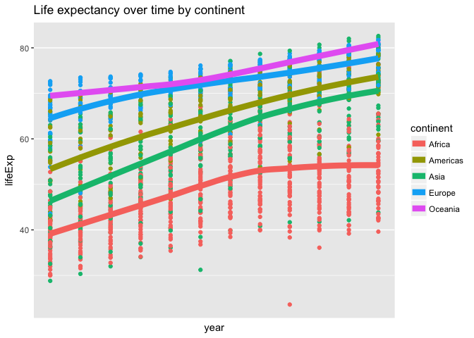<!-- -->

#### 3.2 Bar charts


```r
ggplot(gapminder, aes(x = continent)) + geom_bar()
```

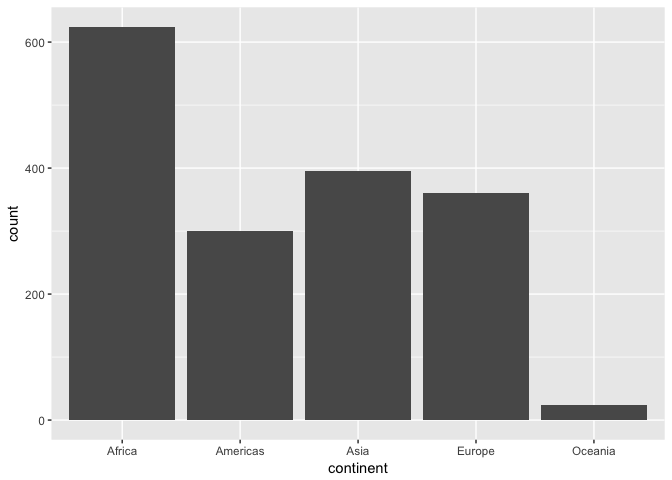<!-- -->

#### 3.3 Density plot


```r
ggplot(subset(gapminder, continent != "Oceania"), #removing Oceania to simplify because only 2 countries...
              aes(x = lifeExp, color = continent)) + geom_density()
```

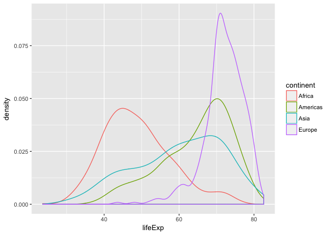<!-- -->

#### 3.4 Boxplots (1 categorical, 1 quantitative)


```r
ggplot(gapminder, aes(x = continent, y = lifeExp)) + geom_boxplot(aes(colour=continent))
```

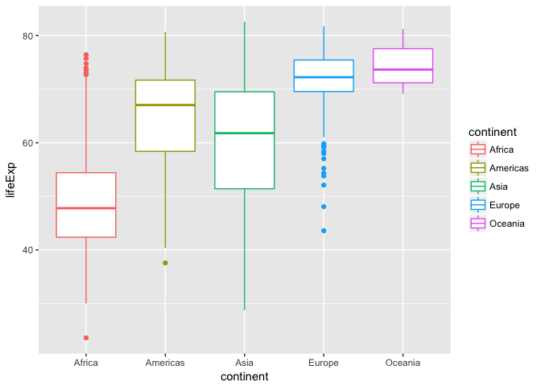<!-- -->


## 4. Using `filter()` and `select()`

I recently listened to a podcast about gender equity and political changes post-genocide in Rwanda. As such, I'd like to have  a closer look at gdpPercap and lifeExp in Rwanda chronologically. First I'll use the ```filter``` function to pull up the data from Rwanda and see what we're working with.

#### 4.1 Life Expectancy in Rwanda


```r
filter(gapminder, country=="Rwanda")
```

```
## # A tibble: 12 x 6
##    country continent  year lifeExp     pop gdpPercap
##     <fctr>    <fctr> <int>   <dbl>   <int>     <dbl>
##  1  Rwanda    Africa  1952  40.000 2534927  493.3239
##  2  Rwanda    Africa  1957  41.500 2822082  540.2894
##  3  Rwanda    Africa  1962  43.000 3051242  597.4731
##  4  Rwanda    Africa  1967  44.100 3451079  510.9637
##  5  Rwanda    Africa  1972  44.600 3992121  590.5807
##  6  Rwanda    Africa  1977  45.000 4657072  670.0806
##  7  Rwanda    Africa  1982  46.218 5507565  881.5706
##  8  Rwanda    Africa  1987  44.020 6349365  847.9912
##  9  Rwanda    Africa  1992  23.599 7290203  737.0686
## 10  Rwanda    Africa  1997  36.087 7212583  589.9445
## 11  Rwanda    Africa  2002  43.413 7852401  785.6538
## 12  Rwanda    Africa  2007  46.242 8860588  863.0885
```

Now, I'll use the filter function and piping to make a scatterplot of life expectancy over time. 


```r
gapminder %>% 
  filter(country == "Rwanda") %>%
ggplot(aes(x = year, y = lifeExp)) + 
   geom_point() + # no need for alpha transparency
  geom_smooth(se=FALSE) #removing standard error and allowing for curvy line
```

```
## `geom_smooth()` using method = 'loess'
```

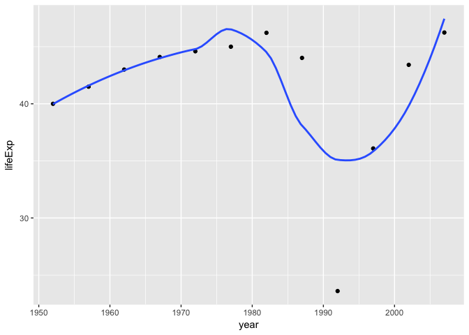<!-- -->

#### 4.2 Life Expectancy in Africa

It might be interesting to look at life expectancy in other/all countries in Africa during a smaller subset of years...


```r
gapminder %>% # altered figure width so we could see the lines better
  filter(continent == "Africa", year >= 1970) %>%
  ggplot(aes(year, lifeExp, group=country, colour=country)) +
  geom_point(alpha=0.3) +
  geom_line()
```

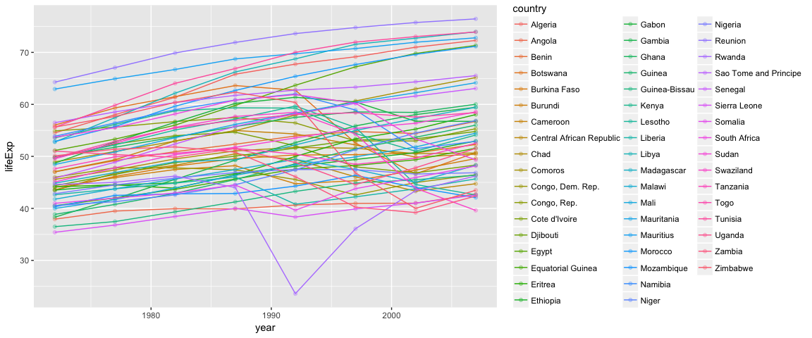<!-- -->

While this is a lot to digest/see, we can clearly see a few outliers in the data at the upper and lower ends

#### 4.3 Life expectancy in Rwanda, Afghanistan, Haiti & Ireland

Then maybe it would be nice to take a look at a few coutries that may show interesting temporal changes in life expectancy. To do this I'd like to call up the data for 4 countries from 4 different continents, and take a closer look at some years more recently...


```r
gapminder %>% 
    filter(country %in% c("Rwanda", "Afghanistan", "Haiti", "Ireland"), 
           year >= 1970) %>% 
    select(country, year, lifeExp)
```

```
## # A tibble: 32 x 3
##        country  year lifeExp
##         <fctr> <int>   <dbl>
##  1 Afghanistan  1972  36.088
##  2 Afghanistan  1977  38.438
##  3 Afghanistan  1982  39.854
##  4 Afghanistan  1987  40.822
##  5 Afghanistan  1992  41.674
##  6 Afghanistan  1997  41.763
##  7 Afghanistan  2002  42.129
##  8 Afghanistan  2007  43.828
##  9       Haiti  1972  48.042
## 10       Haiti  1977  49.923
## # ... with 22 more rows
```

Now we can look at these changes for each country over time graphically using the ggplot functions.


```r
gapminder %>% 
    filter(country %in% c("Rwanda", "Afghanistan", "Haiti", "Ireland")) %>% 
  ggplot(aes(year, lifeExp, colour=country)) +
  geom_point() +
  geom_line()
```

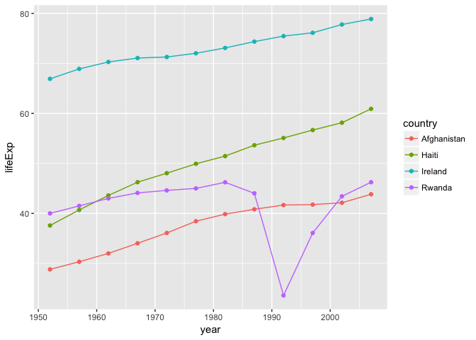<!-- -->
From this we can see some clear differences between these four countries,and notably the swift and severe decline of life expectancy in Rwanda (corresponding to the 1994 genocide). Note that this minimum is actually in 1992 - there is no data for 1994 (and likely the true minimum is not captured).

## 5. But I want to do more!

Funnily enough, I had not seen this part of the homework before making my selection (or filters, rather...) of countries above.


```r
filter(gapminder, country == c("Rwanda", "Afghanistan"))
```

```
## # A tibble: 12 x 6
##        country continent  year lifeExp      pop gdpPercap
##         <fctr>    <fctr> <int>   <dbl>    <int>     <dbl>
##  1 Afghanistan      Asia  1957  30.332  9240934  820.8530
##  2 Afghanistan      Asia  1967  34.020 11537966  836.1971
##  3 Afghanistan      Asia  1977  38.438 14880372  786.1134
##  4 Afghanistan      Asia  1987  40.822 13867957  852.3959
##  5 Afghanistan      Asia  1997  41.763 22227415  635.3414
##  6 Afghanistan      Asia  2007  43.828 31889923  974.5803
##  7      Rwanda    Africa  1952  40.000  2534927  493.3239
##  8      Rwanda    Africa  1962  43.000  3051242  597.4731
##  9      Rwanda    Africa  1972  44.600  3992121  590.5807
## 10      Rwanda    Africa  1982  46.218  5507565  881.5706
## 11      Rwanda    Africa  1992  23.599  7290203  737.0686
## 12      Rwanda    Africa  2002  43.413  7852401  785.6538
```

The analyst did succeed in calling up some of the data entries for Rwanda and Afghanistan from the Gapminder dataset. However, these do not seem to be all of the entries for each of these countries. Instead, the analyst has gotten one unique entry for each year, with half corresponding to each of the two countries. I have queried this command (`combine`), but can't quite reason why it returns unique values to each year... look forward to hearing the answer!


