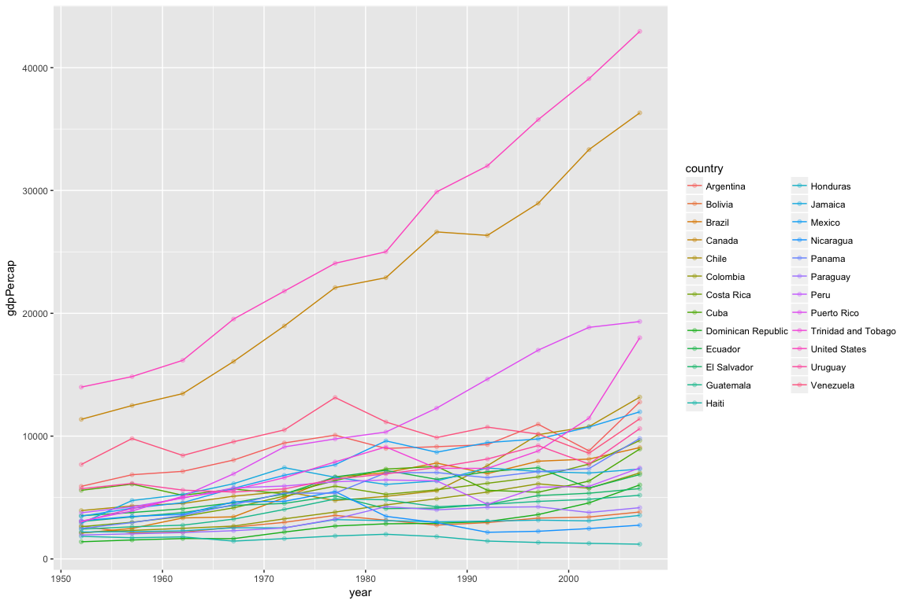

# hw03
2017-10-02  

### By Susanna Klassen


```r
suppressPackageStartupMessages(library(tidyverse))
suppressPackageStartupMessages(library(gapminder))
knitr::opts_chunk$set(fig.width=4, fig.height=3)
```


## Outline

I will accomplish the following (+) tasks in this assignment
1. Look at the spread of GDP per capita within the continents.
2. How is life expectancy changing over time on different continents?
3. Find a few countries with interesting stories and explore them.


```r
library(gapminder)
library(tidyverse)
```


### 1. GDP per capita by continent

#### 1.1 Table

To look at the spread of GDP per capita by continent I will use the `group_by` function in conjunction with piping.


```r
gapminder %>%
  group_by(continent) %>%
summarize(min_gdpPercap=min(gdpPercap), max_gdpPercap=max(gdpPercap), mean_gdpPercap=mean(gdpPercap)) 
```

```
## # A tibble: 5 x 4
##   continent min_gdpPercap max_gdpPercap mean_gdpPercap
##      <fctr>         <dbl>         <dbl>          <dbl>
## 1    Africa      241.1659      21951.21       2193.755
## 2  Americas     1201.6372      42951.65       7136.110
## 3      Asia      331.0000     113523.13       7902.150
## 4    Europe      973.5332      49357.19      14469.476
## 5   Oceania    10039.5956      34435.37      18621.609
```


#### 1.2 Figure


```r
gapminder %>%
  group_by(continent) %>%
  ggplot(aes(x = continent, y = gdpPercap)) + geom_boxplot(aes(colour=continent))
```

<!-- -->

This boxplot clearly depicts how the spread of GDP per capita differs between continents, and allows us to get a much better sense of the spread of values more quickly than with the table. For example, the range of values for Africa is quite narrow, versus that of Asia or Europe, both of which exhibit different trends in central tendency. 

### 2. Changes in life expectancy over time by continent

#### 2.1 Table

I'll create a table that uses the `mutate` function to display changes in life expectancy over time by continent. I will also select only the variables I want to display (dropping pop and gdpPercap).


```r
gapminder %>%
  group_by(continent) %>%
  select(country, continent, year, lifeExp) %>%
  mutate(lifeExp_change = lifeExp - lifeExp[1])
```

```
## # A tibble: 1,704 x 5
## # Groups:   continent [5]
##        country continent  year lifeExp lifeExp_change
##         <fctr>    <fctr> <int>   <dbl>          <dbl>
##  1 Afghanistan      Asia  1952  28.801          0.000
##  2 Afghanistan      Asia  1957  30.332          1.531
##  3 Afghanistan      Asia  1962  31.997          3.196
##  4 Afghanistan      Asia  1967  34.020          5.219
##  5 Afghanistan      Asia  1972  36.088          7.287
##  6 Afghanistan      Asia  1977  38.438          9.637
##  7 Afghanistan      Asia  1982  39.854         11.053
##  8 Afghanistan      Asia  1987  40.822         12.021
##  9 Afghanistan      Asia  1992  41.674         12.873
## 10 Afghanistan      Asia  1997  41.763         12.962
## # ... with 1,694 more rows
```

This table doesn't really allow me to see much, actually. I'll try another method, this time taking the mean life expectancy over the last 20 years in the dataset, and arranging by these values.


```r
gapminder %>%
  filter(year >= 1987) %>%
  group_by(country) %>%
  summarize(mean_lifeExp=mean(lifeExp)) %>%
  arrange(mean_lifeExp)
```

```
## # A tibble: 142 x 2
##             country mean_lifeExp
##              <fctr>        <dbl>
##  1           Rwanda      38.6722
##  2     Sierra Leone      40.3632
##  3           Angola      41.0500
##  4      Afghanistan      42.0432
##  5          Liberia      43.6962
##  6           Zambia      43.7472
##  7       Mozambique      43.9194
##  8    Guinea-Bissau      44.2552
##  9          Somalia      44.4098
## 10 Congo, Dem. Rep.      45.3950
## # ... with 132 more rows
```
This allows us to quickly get a sense of the countries with the lowest mean life expectancy in the last 20 years.


#### 2.2 Figure

As I'm wanting to plot two continuous variables for this task, I'll want to use a scatter plot. I'll fit a line to the data to better display the change in life expectancy by continent over time. 


```r
gapminder %>%
  group_by(continent) %>%
  select(country, continent, year, lifeExp) %>%
  ggplot(aes(year, lifeExp, color = continent)) + 
  geom_point(aes(alpha=0.2)) +
  geom_smooth()
```

```
## `geom_smooth()` using method = 'loess'
```

<!-- -->
This scatterplot aggregated at the scale of a continent is a fairly simple figure both to produce and interpret.

### 3. Countries with interesting stories

#### 3.1 Exploring the Americas

My first thought is to explore GDP per capita in Venezuela, which has had a somewhat volatile political and economic history (particularly in the last few years). But before I dive into a specific country and/or variable, I'd like to take a look at trends in that continent more broadly to try to pick out some potentially interesting stories.

#### 3.1.1 Life expectancy in the Americas

Let's look at the average value of life expectancy over the last 20 years of the dataset by country (in the Americas). 


```r
gapminder %>%
  filter(continent == "Americas", year >= 1987) %>%
  group_by(country)%>%
  summarize(mean_lifeExp=mean(lifeExp))%>%
  arrange(mean_lifeExp)
```

```
## # A tibble: 25 x 2
##               country mean_lifeExp
##                <fctr>        <dbl>
##  1              Haiti      56.8898
##  2            Bolivia      61.7390
##  3          Guatemala      65.9428
##  4           Honduras      67.4626
##  5          Nicaragua      68.0024
##  6               Peru      68.0610
##  7        El Salvador      68.4198
##  8             Brazil      69.0092
##  9           Paraguay      69.5020
## 10 Dominican Republic      69.5084
## # ... with 15 more rows
```


Now let's plot that:


```r
gapminder %>% # altered figure width (12) and height (8) so we could see the lines better
  filter(continent == "Americas") %>%
  ggplot(aes(year, lifeExp, group=country, colour=country)) +
  geom_point(alpha=0.3) +
  geom_line()
```

<!-- -->

While it is difficult to see which colorus are which (the legend is only marginally helpful), there are some interesting stories in there.
1. A sizeable increase over this time period for most countries!(and one country showing a significant dip around 1982 -- civil war in El Salvador?)
2. Canada consistently showing the highest value
3. The United States drops below some other countries later in this time period

Checking my hypothesis for 2 above:


```r
gapminder %>% # altered figure width (12) and height (8) so we could see the lines better
  filter(country == "El Salvador") %>%
  ggplot(aes(year, lifeExp, group=country, colour=country)) +
  geom_point(alpha=0.3) +
  geom_line()
```

<!-- -->

Hypothesis confirmed!


#### 3.1.2 GDP per capita in the Americas

Let's take a look at GDP in the Americas now.


```r
gapminder %>% 
  filter(continent == "Americas") %>%
  ggplot(aes(year, gdpPercap, group=country, colour=country)) +
  geom_point(alpha=0.3) +
  geom_line()
```

<!-- -->

This spaghetti plot is similar to the last - it's difficult to tease out which country is which from the legend, but I can clearly see some outliers in this plot (Canada & US). Let's drop off Canada and the US to get a closer look at Central & South America (+ Mexico)


```r
gapminder %>% 
  filter(continent == "Americas", country != "Canada", country != "United States") %>%
  ggplot(aes(year, gdpPercap, group=country, colour=country)) +
  geom_point(alpha=0.3) +
  geom_line() 
```

<!-- -->

Another option would be to use colours to highlight a few countries of interest (e.g. making all lines black but Venezuela). I'm not sure exactly how to do this at this point and am out of time, but am flagging this as an idea for future exploration. 

#### 3.2 Comparing changes in GDP per capita in 5 countries

It was a bit difficult to 'zoom' in on a few of the more interesting patterns in the figure above, but using some trial and error (I look forward to learning a more efficient way of doing this!), I found that Venezuela, Haiti, Puerto Rico, Trinidad and Tobago, and Nicaragua all exhibited interesting trends in GDP per capita over time. 


```r
gapminder %>% 
  filter(country %in% c("Venezuela", "Haiti", "Puerto Rico", "Trinidad and Tobago", "Nicaragua")) %>%
  ggplot(aes(year, gdpPercap, group=country, colour=country)) +
  geom_point(alpha=0.3) +
  geom_line() 
```

<!-- -->

By isolating these five cases, now we can really compare and contrast trends in gdpPercap over time. 


```r
gapminder %>% 
  filter(country %in% c("Venezuela", "Haiti", "Puerto Rico", "Trinidad and Tobago", "Nicaragua")) %>% 
  arrange(year) %>%
  ggplot(aes(gdpPercap, lifeExp, group=country, colour=country)) +
  facet_wrap(~ country) +
  geom_point(alpha=0.2) +
  geom_path() 
```

<!-- -->
This was an imperfect attempt to display trends in GDP per capita and life expectancy (2 continuous variables) in these 5 countries using faceting. It shows something, but maybe isn't a fully successful attempt. Let's try reversing the x and y variables...


```r
gapminder %>% 
  filter(country %in% c("Venezuela", "Haiti", "Puerto Rico", "Trinidad and Tobago", "Nicaragua")) %>% 
  arrange(year) %>%
  ggplot(aes(lifeExp, gdpPercap, group=country, colour=country)) +
  facet_wrap(~ country) +
  geom_point(alpha=0.2) +
  geom_path()
```

<!-- -->

Still kind of a convoulted way to look at these variables...

All in one plot (with gdpPercap as the independent and lifeExp as dependent):


```r
gapminder %>% 
  filter(country %in% c("Venezuela", "Haiti", "Puerto Rico", "Trinidad and Tobago", "Nicaragua")) %>% 
  ggplot(aes(gdpPercap, lifeExp, colour=country)) +
  geom_point() +
  geom_smooth(aes(fill=country)) 
```

```
## `geom_smooth()` using method = 'loess'
```

<!-- -->

We can observe that Puerto Rico and Trinidad and Tobago exhibit similar relationships between the two measures (positive) and relatively stable. Haiti, Nicaragua and Venezuela on the other hand show a fair bit of variability in life expectancy, and relatively lower values for GDP per capita (Venezuela being the highest of those three).

#### 3.3 Contrasting Nicaragua and Puerto Rico

These two nations are interesting to contrast, as they display very different trends in life expectancy, but are geographically close to one another (which doesn't necessarily mean anything, but alas, it is interesting).

Let's look more closely at the change in GDP per capita in Puerto Rico...


```r
gapminder %>%
  filter(country == "Puerto Rico") %>% 
  select(country, continent, year, pop, gdpPercap)
```

```
## # A tibble: 12 x 5
##        country continent  year     pop gdpPercap
##         <fctr>    <fctr> <int>   <int>     <dbl>
##  1 Puerto Rico  Americas  1952 2227000  3081.960
##  2 Puerto Rico  Americas  1957 2260000  3907.156
##  3 Puerto Rico  Americas  1962 2448046  5108.345
##  4 Puerto Rico  Americas  1967 2648961  6929.278
##  5 Puerto Rico  Americas  1972 2847132  9123.042
##  6 Puerto Rico  Americas  1977 3080828  9770.525
##  7 Puerto Rico  Americas  1982 3279001 10330.989
##  8 Puerto Rico  Americas  1987 3444468 12281.342
##  9 Puerto Rico  Americas  1992 3585176 14641.587
## 10 Puerto Rico  Americas  1997 3759430 16999.433
## 11 Puerto Rico  Americas  2002 3859606 18855.606
## 12 Puerto Rico  Americas  2007 3942491 19328.709
```

And comparing changes in GDP per capita over time for both countries...


```r
gapminder %>% 
  filter(country %in% c("Puerto Rico","Nicaragua")) %>% 
  ggplot(aes(year, gdpPercap, color = country)) + 
  geom_point() +
  geom_smooth()
```

```
## `geom_smooth()` using method = 'loess'
```

<!-- -->

Let's see how they compare when we factor in changes in population...


```r
gapminder %>% 
  filter(country %in% c("Puerto Rico","Nicaragua")) %>% 
  ggplot(aes(pop, gdpPercap, color = country)) + 
  geom_point() +
  geom_smooth()
```

```
## `geom_smooth()` using method = 'loess'
```

<!-- -->

Wow! That is super interesting... it looks like they have experienced very different trends in population growth... let's visualize that to compare them.


```r
gapminder %>% 
  filter(country %in% c("Puerto Rico","Nicaragua")) %>% 
  ggplot(aes(year, pop, color = country)) + 
  geom_point() +
  geom_smooth()
```

```
## `geom_smooth()` using method = 'loess'
```

<!-- -->

Puerto Rico has seen more gradual population growth, starting with a higher population, but Nicaragua's population surpassed it around 1987. This shows that growth in GDP in Puerto Rico must have outpaced population growth (as the GDP per capita value becomes quite high later on in this time period.)


