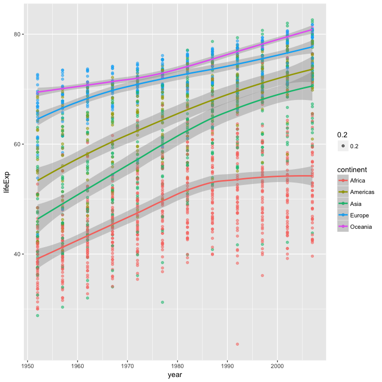
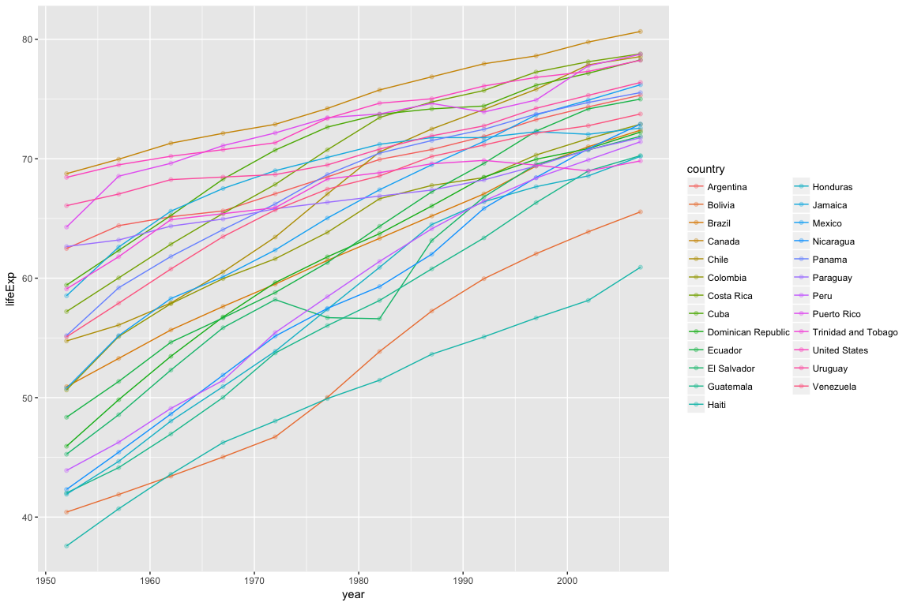
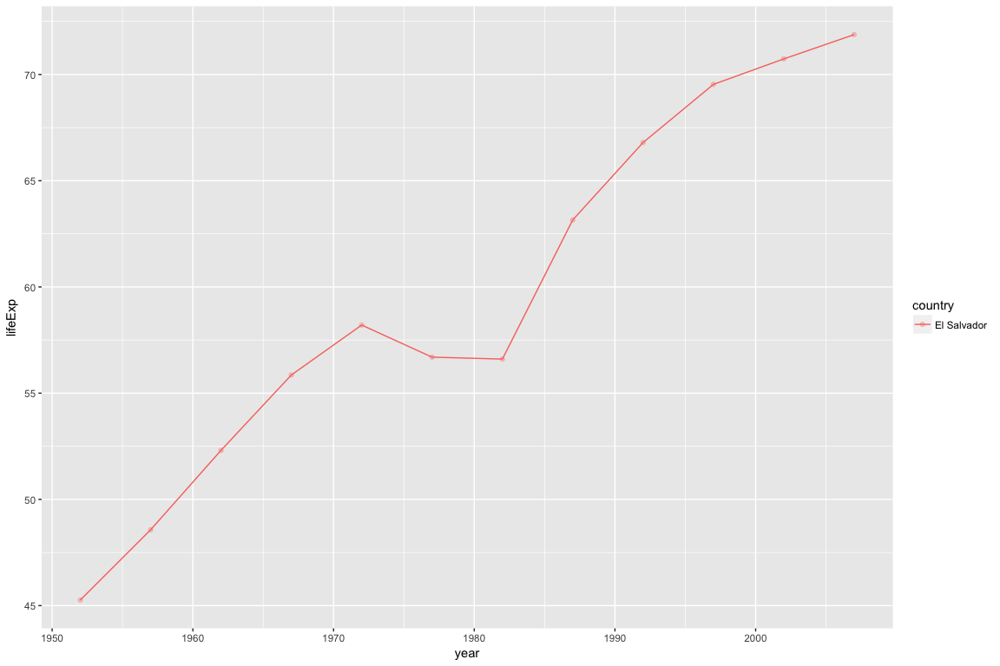

# hw03
2017-10-02  

# Homework 3
### By Susanna Klassen


```r
suppressPackageStartupMessages(library(tidyverse))  #Note to inquire/remind myself about the functionality of these options
suppressPackageStartupMessages(library(gapminder))
knitr::opts_chunk$set(fig.width=4, fig.height=3)
```


## Outline

I will be accomplishing the following tasks in this assignment
1. Look at the spread of GDP per capita within the continents.
2. How is life expectancy changing over time on different continents?
3. Find countries with interesting stories. Open-ended and, therefore, hard. Promising but unsuccessful attempts are encouraged. This will generate interesting questions to follow up on in class.


```r
library(gapminder)
library(tidyverse)
```


### 1. GDP per capita by continent

#### 1.1 Table

To look at the spread of GDP per capita by continent I will use the `groupby` function in conjunction with piping.


```r
gapminder %>%
  group_by(continent) %>%
summarize(min(gdpPercap), max(gdpPercap), mean(gdpPercap)) 
```

```
## # A tibble: 5 x 4
##   continent `min(gdpPercap)` `max(gdpPercap)` `mean(gdpPercap)`
##      <fctr>            <dbl>            <dbl>             <dbl>
## 1    Africa         241.1659         21951.21          2193.755
## 2  Americas        1201.6372         42951.65          7136.110
## 3      Asia         331.0000        113523.13          7902.150
## 4    Europe         973.5332         49357.19         14469.476
## 5   Oceania       10039.5956         34435.37         18621.609
```

Thinking there might be a more elegant way of getting this info (all measures of the same variable)


```r
gapminder %>%
  group_by(continent) %>%
summarize_each(funs(min, max, mean), gdpPercap) # could also add other variables here if I wanted these same stats for multiple variables
```

```
## `summarise_each()` is deprecated.
## Use `summarise_all()`, `summarise_at()` or `summarise_if()` instead.
## To map `funs` over a selection of variables, use `summarise_at()`
```

```
## # A tibble: 5 x 4
##   continent gdpPercap_min gdpPercap_max gdpPercap_mean
##      <fctr>         <dbl>         <dbl>          <dbl>
## 1    Africa      241.1659      21951.21       2193.755
## 2  Americas     1201.6372      42951.65       7136.110
## 3      Asia      331.0000     113523.13       7902.150
## 4    Europe      973.5332      49357.19      14469.476
## 5   Oceania    10039.5956      34435.37      18621.609
```
That also worked!

#### 1.2 Figure


```r
gapminder %>%
  group_by(continent) %>%
  ggplot(aes(x = continent, y = gdpPercap)) + geom_boxplot(aes(colour=continent))
```

<!-- -->

This boxplot clearly depicts how the spread of GDP per capita differs between continents, and allows us to get a much better sense of the spread of values more quickly than with the table. For example, the range of values for Africa is quite narrow, versus that of Asia or Europe, both of which exhibit different trends in central tendency. 

### 2. Changes in life expectancy over time by continent

#### 2.1 Table

I'll create a table that uses the `mutate` function to display changes in life expectancy over time by continent. I will also select only the variables I want to display (dropping pop and gdpPercap).


```r
gapminder %>%
  group_by(continent) %>%
  select(country, continent, year, lifeExp) %>%
  mutate(lifeExp_change = lifeExp - lifeExp[1])
```

```
## # A tibble: 1,704 x 5
## # Groups:   continent [5]
##        country continent  year lifeExp lifeExp_change
##         <fctr>    <fctr> <int>   <dbl>          <dbl>
##  1 Afghanistan      Asia  1952  28.801          0.000
##  2 Afghanistan      Asia  1957  30.332          1.531
##  3 Afghanistan      Asia  1962  31.997          3.196
##  4 Afghanistan      Asia  1967  34.020          5.219
##  5 Afghanistan      Asia  1972  36.088          7.287
##  6 Afghanistan      Asia  1977  38.438          9.637
##  7 Afghanistan      Asia  1982  39.854         11.053
##  8 Afghanistan      Asia  1987  40.822         12.021
##  9 Afghanistan      Asia  1992  41.674         12.873
## 10 Afghanistan      Asia  1997  41.763         12.962
## # ... with 1,694 more rows
```

Note: Could do more to try to take the average here but not statistically a good move?

#### 2.2 Figure

As I'm wanting to plot two continuous variables for this task, I'll want to use a scatter plot. I'll fit a line to the data to better display the change in life expectancy by continent over time. 


```r
gapminder %>%
  group_by(continent) %>%
  select(country, continent, year, lifeExp) %>%
  ggplot(aes(year, lifeExp,
            color = continent)) + 
  geom_point() +
  geom_smooth()
```

```
## `geom_smooth()` using method = 'loess'
```

<!-- -->


### 3. Countries with interesting stories

#### 3.1 Exploring the Americas

My first thought is to explore GDP per capita in Venezuela, which has had a somewhat volatile political and economic history (particularly in the last few yeasrs). But before I dive into a specific country, I might as well look at trends in that continent more broadly to try to pick out some potentially interesting stories (which means I'll need to look more broadly at the Americas).

#### 3.1.1 Life expectancy in the Americas


```r
gapminder %>% # altered figure width so we could see the lines better
  filter(continent == "Americas") %>%
  ggplot(aes(year, lifeExp, group=country, colour=country)) +
  geom_point(alpha=0.3) +
  geom_line()
```

<!-- -->

OK - some interesting stories in there.
1. A drastic increase over this time period for some!
2. Canada consistently showing the highest value
3. The United States drops below some other countries later in this time period

#### 3.1.2 GDP per capita in the Americas


```r
gapminder %>% # altered figure width so we could see the lines better
  filter(continent == "Americas") %>%
  ggplot(aes(year, gdpPercap, group=country, colour=country)) +
  geom_point(alpha=0.3) +
  geom_line()
```

<!-- -->

Let's drop off Canada and the US to get a closer look at Central & South America (+ Mexico)


```r
gapminder %>% # altered figure width so we could see the lines better
  filter(continent == "Americas", country != "Canada", country != "United States") %>%
  ggplot(aes(year, gdpPercap, group=country, colour=country)) +
  geom_point(alpha=0.3) +
  geom_line() 
```

<!-- -->

#### 3.2 Comparing changes in GDP per capita in 5 countries

It was a bit difficult to 'zoom' in on a few of the more interesting patterns in the figure above, but using some trial and error (I look forward to learning a more efficient way of doing this!), I found that Venezuela, Haiti, Puerto Rico, Trinidad and Tobago, and Nicaragua all exhibited interesting trends in GDP per capita over time. 


```r
gapminder %>% # altered figure width so we could see the lines better
  filter(country %in% c("Venezuela", "Haiti", "Puerto Rico", "Trinidad and Tobago", "Nicaragua")) %>%
  ggplot(aes(year, gdpPercap, group=country, colour=country)) +
  geom_point(alpha=0.3) +
  geom_line() 
```

<!-- -->

#### 3.3 Contrasting Nicaragua and Puerto Rico

These two nations are interesting to contrast, as they display very different trends in life expectancy, but are geographically close to one another (which doesn't necessarily mean anything, but alas, it is interesting).


```r
gapminder %>% 
  filter(country %in% c("Venezuela", "Haiti", "Puerto Rico", "Trinidad and Tobago", "Nicaragua")) %>% 
  ggplot(aes(gdpPercap, lifeExp, group=country, colour=country)) +
  facet_wrap(~ country) +
  geom_point(alpha=0.2) +
  geom_line()
```

<!-- -->


