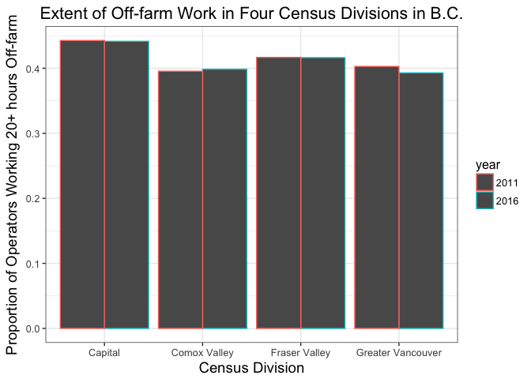

# hw04

First I'll need to load the tidyverse and knitr packages:


```r
library(tidyverse)
```

```
## Loading tidyverse: ggplot2
## Loading tidyverse: tibble
## Loading tidyverse: tidyr
## Loading tidyverse: readr
## Loading tidyverse: purrr
## Loading tidyverse: dplyr
```

```
## Conflicts with tidy packages ----------------------------------------------
```

```
## filter(): dplyr, stats
## lag():    dplyr, stats
```

```r
library(knitr)
```


## Introducing my tasks for hw04

I have imported several data tables into my local environment, but want to create a new dataset to work with that will contain information from both. Specifically, I am interested in the various levels of off-farm paid work and on-farm capital in various Census Divisions (CD) in British Columbia (BC), particularly those with a high number of blueberry farms.

All of the data frames have values for each CD in BC, but they vary in their number of observations per CD (some have many as they are count data across various categories). All data frames have values for both 2011 and 2016. 

## 1. Re-shaping my data

I am going to perform a variation on Activity #2, using Stats Canada Agricultural Census Data instead of the Gapminder data. Note that I first need to save my newly imported dataset as an Rdata file (using ```save(Blueberry_Farms, file="Blueberry_Farms.RData")```), and then load it using the following chunk:


```r
load(file = "Blueberry_Farms.RData")
```


I need to do the same with the (1) Off-farm Work and (2) Total Farm Capital dataframes that I will use later on:


```r
load(file = "PaidNonFarmWork.RData")
load(file = "TotalFarmCapital.RData")
```


### 1.1 Using ```gather``` to make a longer dataframe

Currently, one of my dataframes has 2 variables (columns) for each year, and I'd like to re-shape it so that it has a single row per year (and one variable for number of "farms reporting blueberries").


```r
knitr::kable(Blueberry_Farms)
```


CD_Region                Unit                                     2011   2016
-----------------------  --------------------------------------  -----  -----
Capital                  Number of farms reporting blueberries     112    102
Cowichan Valley          Number of farms reporting blueberries      34     40
Nanaimo                  Number of farms reporting blueberries      33     42
Alberni-Clayoquot        Number of farms reporting blueberries       5      9
Strathcona               Number of farms reporting blueberries       8      7
Comox Valley             Number of farms reporting blueberries      34     43
Powell River             Number of farms reporting blueberries      18     15
Mount Waddington         Number of farms reporting blueberries       0      1
Central Coast            Number of farms reporting blueberries       2      2
Fraser Valley            Number of farms reporting blueberries     493    540
Greater Vancouver        Number of farms reporting blueberries     504    485
Sunshine Coast           Number of farms reporting blueberries       9     11
Squamish-Lillooet        Number of farms reporting blueberries       5      7
Okanagan-Similkameen     Number of farms reporting blueberries      12     30
Thompson-Nicola          Number of farms reporting blueberries       7     11
Central Okanagan         Number of farms reporting blueberries      19     25
North Okanagan           Number of farms reporting blueberries       7     14
Columbia-Shuswap         Number of farms reporting blueberries       6     12
East Kootenay            Number of farms reporting blueberries       1      0
Central Kootenay         Number of farms reporting blueberries      17     23
Kootenay Boundary        Number of farms reporting blueberries       5      3
Cariboo                  Number of farms reporting blueberries       4      8
Fraser-Fort George       Number of farms reporting blueberries       5      3
Skeena-Queen Charlotte   Number of farms reporting blueberries       0      1
Kitimat-Stikine          Number of farms reporting blueberries       4      3
Bulkley-Nechako          Number of farms reporting blueberries       4      4
Stikine                  Number of farms reporting blueberries       0      0
Peace River              Number of farms reporting blueberries       0      3
Northern Rockies         Number of farms reporting blueberries       0      0

To re-shape this, I'll use the ```gather``` function. I'll also name this new table "bf", arrange the observations by CD_Region, select for the Census Division name, year, and number of blueberry farms.   


```r
bf <- Blueberry_Farms %>%
  gather(key = "year", value = "blueberry_farms", "2011":"2016") %>%
  arrange(CD_Region) %>%
  select(CD_Region, year, blueberry_farms) 
  knitr::kable(bf)
```


CD_Region                year    blueberry_farms
-----------------------  -----  ----------------
Alberni-Clayoquot        2011                  5
Alberni-Clayoquot        2016                  9
Bulkley-Nechako          2011                  4
Bulkley-Nechako          2016                  4
Capital                  2011                112
Capital                  2016                102
Cariboo                  2011                  4
Cariboo                  2016                  8
Central Coast            2011                  2
Central Coast            2016                  2
Central Kootenay         2011                 17
Central Kootenay         2016                 23
Central Okanagan         2011                 19
Central Okanagan         2016                 25
Columbia-Shuswap         2011                  6
Columbia-Shuswap         2016                 12
Comox Valley             2011                 34
Comox Valley             2016                 43
Cowichan Valley          2011                 34
Cowichan Valley          2016                 40
East Kootenay            2011                  1
East Kootenay            2016                  0
Fraser Valley            2011                493
Fraser Valley            2016                540
Fraser-Fort George       2011                  5
Fraser-Fort George       2016                  3
Greater Vancouver        2011                504
Greater Vancouver        2016                485
Kitimat-Stikine          2011                  4
Kitimat-Stikine          2016                  3
Kootenay Boundary        2011                  5
Kootenay Boundary        2016                  3
Mount Waddington         2011                  0
Mount Waddington         2016                  1
Nanaimo                  2011                 33
Nanaimo                  2016                 42
North Okanagan           2011                  7
North Okanagan           2016                 14
Northern Rockies         2011                  0
Northern Rockies         2016                  0
Okanagan-Similkameen     2011                 12
Okanagan-Similkameen     2016                 30
Peace River              2011                  0
Peace River              2016                  3
Powell River             2011                 18
Powell River             2016                 15
Skeena-Queen Charlotte   2011                  0
Skeena-Queen Charlotte   2016                  1
Squamish-Lillooet        2011                  5
Squamish-Lillooet        2016                  7
Stikine                  2011                  0
Stikine                  2016                  0
Strathcona               2011                  8
Strathcona               2016                  7
Sunshine Coast           2011                  9
Sunshine Coast           2016                 11
Thompson-Nicola          2011                  7
Thompson-Nicola          2016                 11

### 1.2 Make a plot comparing number of blueberry farms by region

While in the hw04 description activity 2 (re-shaping) involves plotting life expectancy in 2 countries to compare (using multiple years of data), here I only have 2 years of data, but am interested to compare multiple regions. Let's figure out which regions have the highest number of blueberry farms.


```r
bf %>% 
  arrange(desc(blueberry_farms)) %>% # add desc argument to display highest values first
  knitr::kable()
```


CD_Region                year    blueberry_farms
-----------------------  -----  ----------------
Fraser Valley            2016                540
Greater Vancouver        2011                504
Fraser Valley            2011                493
Greater Vancouver        2016                485
Capital                  2011                112
Capital                  2016                102
Comox Valley             2016                 43
Nanaimo                  2016                 42
Cowichan Valley          2016                 40
Comox Valley             2011                 34
Cowichan Valley          2011                 34
Nanaimo                  2011                 33
Okanagan-Similkameen     2016                 30
Central Okanagan         2016                 25
Central Kootenay         2016                 23
Central Okanagan         2011                 19
Powell River             2011                 18
Central Kootenay         2011                 17
Powell River             2016                 15
North Okanagan           2016                 14
Columbia-Shuswap         2016                 12
Okanagan-Similkameen     2011                 12
Sunshine Coast           2016                 11
Thompson-Nicola          2016                 11
Alberni-Clayoquot        2016                  9
Sunshine Coast           2011                  9
Cariboo                  2016                  8
Strathcona               2011                  8
North Okanagan           2011                  7
Squamish-Lillooet        2016                  7
Strathcona               2016                  7
Thompson-Nicola          2011                  7
Columbia-Shuswap         2011                  6
Alberni-Clayoquot        2011                  5
Fraser-Fort George       2011                  5
Kootenay Boundary        2011                  5
Squamish-Lillooet        2011                  5
Bulkley-Nechako          2011                  4
Bulkley-Nechako          2016                  4
Cariboo                  2011                  4
Kitimat-Stikine          2011                  4
Fraser-Fort George       2016                  3
Kitimat-Stikine          2016                  3
Kootenay Boundary        2016                  3
Peace River              2016                  3
Central Coast            2011                  2
Central Coast            2016                  2
East Kootenay            2011                  1
Mount Waddington         2016                  1
Skeena-Queen Charlotte   2016                  1
East Kootenay            2016                  0
Mount Waddington         2011                  0
Northern Rockies         2011                  0
Northern Rockies         2016                  0
Peace River              2011                  0
Skeena-Queen Charlotte   2011                  0
Stikine                  2011                  0
Stikine                  2016                  0


```r
bf %>%
  filter(CD_Region %in% c("Fraser Valley", "Greater Vancouver", "Capital", "Comox Valley")) %>%
  ggplot(aes(x = CD_Region, y = blueberry_farms)) +
  geom_col(aes(color=year), position = "dodge") +
  labs(x="Census Division", y="Number of Farms", title="Number of Blueberry Farms in Four Census Divisions in B.C.") +
  theme_bw(base_size=12) +
  theme(axis.title = element_text(size=14),
        plot.title = element_text(size=16, hjust = 0.5),
        legend.position = "right",
        legend.direction = "vertical",
        legend.title = element_text(size=12))
```

<!-- -->

It is interesting to see from this plot that the four Census Divisions with highest number of blueberry farms have shown different trends from 2011 and 2016 -- with the Fraser Valley and the Comox Valley showing an increase, and the Capital and Greater Vancouver regions showing a decrease. 

## 2. Preparing additional dataframe for Paid Work Off-farm

I'd also like to take a look at the extent of paid off-farm work in various different CDs. The dataframe for 'PaidNonFarmWork' also has columns for year, so I will again use ```gather``` so that these two dataframes are in the same format.


```r
ofw <- PaidNonFarmWork %>%
  gather(key = "year", value = "number_operators", "2011":"2016") %>%
  arrange(CD_Region) %>%
  select(CD_Region, Avg_Hrs_OffFarmWork, year, number_operators) 
```

Now we have a row for each year of data, and I've defined this new dataframe 'ofw'. 

I'd like to define a single measure for each region to indicate the extent of off-farm work. I think that the proportion of farm operators that work 20+ hours a week off of the farm should be a good measure, so I have some additional re-shaping to do...

### 2.1 Using ```spread```

First, I am going to ```spread``` the data so that I can have the number of operators in each 'bin' as variables instead of observations, as I think it will be easier to work with once in that format. 


```r
ofw_wide <- ofw %>%
  spread(Avg_Hrs_OffFarmWork, number_operators) %>% View 
```

Success! Only after re-considering my approach, I will not use the wide format. So for now I will shelve `ofw_wide`, but will leave this in here as a record for how I did it.


### 2.2 Using ```mutate``` and ```cumsum``` to define a new variable

I want to create a new variable for the proportion of farm operators in each region that work 20+ hours off of the farm (and I have data for two years - 2011 and 2016).

First I will make a new column and call it hours, but I'll just keep it empty. Then I will filter for the values I want to use to make my new measure (number of operators in each of the categories for 20 hours and more [3 categories total]).  
going to make a new coumn and number it so that it is ordered


```r
ofw_20_40 <- ofw %>% 
  mutate(hours = NA) %>% #creating empty column
  filter(!Avg_Hrs_OffFarmWork %in% c("Total Operators", "No off-farm work", "less than 20 hours")) %>% 
  mutate(year = as.factor(year)) %>% #filtering out the values that I don't want (I only want the bins for 20 hours +)
  mutate(CD_Region = as.factor(CD_Region)) %>%  # changing CD_Region variable to a factor to make sure group_by works on it
  mutate(hours = ifelse(Avg_Hrs_OffFarmWork == "No off-farm work", 0, hours)) %>% # assigning new values for the bins
  mutate(hours = ifelse(Avg_Hrs_OffFarmWork == "less than 20 hours", 20, hours)) %>% 
  mutate(hours = ifelse(Avg_Hrs_OffFarmWork == "20 - 29 hours", 29, hours)) %>% 
  mutate(hours = ifelse(Avg_Hrs_OffFarmWork == "30 - 40 hours", 40, hours)) %>% 
  mutate(hours = ifelse(Avg_Hrs_OffFarmWork == "more than 40 hours", 41, hours)) %>% 
  group_by(CD_Region, year) %>%
  arrange(hours) %>%
  group_by(CD_Region, year) %>%
  mutate(cum_operators = cumsum(number_operators)) %>% #creating another new variable to contain the cumulative sum of the number operators in each region by year (for the 3 categories filtered above)
  arrange(CD_Region, year) #to arrange the ordering of the final table
```

In this new dataframe (ofw_20_40), I can see that the new[est] variable (cum_operators) contains the cumulative sum of operators for the 'bins' of 20-29 hours, 30-40 hours, and 40+ hours of off-farm work per week! I only need the third value (the total of the three), so I will filter that out...and call this dataset ofw_40


```r
ofw_40 <- ofw_20_40 %>% 
  filter(Avg_Hrs_OffFarmWork == "more than 40 hours")
```


### 2.3 Joining two dataframes

Now to get the ratio for each region by year, I can use the total number of operators (not found in ofw_20_40 but still in the ofw dataframe I created above). Since this is already a row in the dataset, I will create a new dataframe that contains it, and join it with the one I jsut created with the sum of operators who work more than 20 hours off-farm per week. 


```r
ofw_tot <- ofw %>% 
  filter(Avg_Hrs_OffFarmWork == "Total Operators") %>% 
  select(CD_Region, year, Avg_Hrs_OffFarmWork, number_operators)
```

And to join them, I should have two dataframes with the same number and types of rows (2 rows for each region, for 2011 and 2016 respectively), so I can use any join function, but will use ```left_join```:


```r
left_join(ofw_40, ofw_tot, by = c("CD_Region", "year"))
```

```
## Warning: Column `CD_Region` joining factor and character vector, coercing
## into character vector
```

```
## Warning: Column `year` joining factor and character vector, coercing into
## character vector
```

```
## # A tibble: 58 x 8
## # Groups:   CD_Region, year [?]
##            CD_Region Avg_Hrs_OffFarmWork.x  year number_operators.x hours
##                <chr>                 <chr> <chr>              <dbl> <dbl>
##  1 Alberni-Clayoquot    more than 40 hours  2011                 25    41
##  2 Alberni-Clayoquot    more than 40 hours  2016                 30    41
##  3   Bulkley-Nechako    more than 40 hours  2011                330    41
##  4   Bulkley-Nechako    more than 40 hours  2016                275    41
##  5           Capital    more than 40 hours  2011                305    41
##  6           Capital    more than 40 hours  2016                250    41
##  7           Cariboo    more than 40 hours  2011                300    41
##  8           Cariboo    more than 40 hours  2016                235    41
##  9     Central Coast    more than 40 hours  2011                  5    41
## 10     Central Coast    more than 40 hours  2016                  5    41
## # ... with 48 more rows, and 3 more variables: cum_operators <dbl>,
## #   Avg_Hrs_OffFarmWork.y <chr>, number_operators.y <dbl>
```

This looks great! I have some extra/poorly named columns, so I will re-name these to reflect the actual values contained in them:


```r
left_join(ofw_40, ofw_tot, by = c("CD_Region", "year")) %>% 
  rename(total_operators = number_operators.y, operators_20plus = cum_operators) %>% 
  select(CD_Region, year, total_operators, operators_20plus )
```

```
## Warning: Column `CD_Region` joining factor and character vector, coercing
## into character vector
```

```
## Warning: Column `year` joining factor and character vector, coercing into
## character vector
```

```
## # A tibble: 58 x 4
## # Groups:   CD_Region, year [58]
##            CD_Region  year total_operators operators_20plus
##                <chr> <chr>           <dbl>            <dbl>
##  1 Alberni-Clayoquot  2011             150               55
##  2 Alberni-Clayoquot  2016             145               65
##  3   Bulkley-Nechako  2011            1300              660
##  4   Bulkley-Nechako  2016            1165              525
##  5           Capital  2011            1660              735
##  6           Capital  2016            1495              660
##  7           Cariboo  2011            1705              690
##  8           Cariboo  2016            1440              575
##  9     Central Coast  2011              40               20
## 10     Central Coast  2016              25               15
## # ... with 48 more rows
```

One step closer! Now I can use the ```mutate``` function to create a new variable with the proportion using the values in operators_20plus and total_operators:


```r
ofw_prop <- left_join(ofw_40, ofw_tot, by = c("CD_Region", "year")) %>% 
  rename(total_operators = number_operators.y, operators_20plus = cum_operators) %>% 
  select(CD_Region, year, total_operators, operators_20plus ) %>% 
  mutate(prop_20plus = operators_20plus/total_operators)
```

```
## Warning: Column `CD_Region` joining factor and character vector, coercing
## into character vector
```

```
## Warning: Column `year` joining factor and character vector, coercing into
## character vector
```


## 3. Joining two *more* dataframes

Now that I have re-shaped two dataframes, I will join them! Because I should have the same observations by region and year, I simply want to combine the columns/variables. As such, I will use the ```full_join``` function.


```r
blue_off_farm <- full_join(ofw_prop, bf, by = c("CD_Region", "year")) 
```
### 3.1 Plotting them

Now I'm going to use my newly cleaned, shaped and joined datasets to make a plot:


```r
blue_off_farm %>% 
  ggplot(aes(prop_20plus, blueberry_farms, colour=CD_Region)) +
  geom_point()
```

```
## Warning: Removed 3 rows containing missing values (geom_point).
```

<!-- -->


