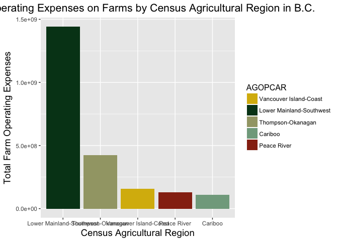
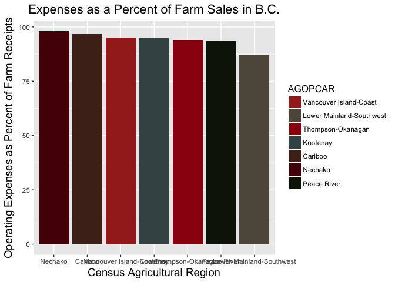

# hw05

## 0. Pre-amble


I'm going to use both the gapminder dataset and a dataset from the Canadian Census of Agriculture to go through the exercises for hw05.

First I'll load all of the packages I'm going to need for this assignment in one tidy chunk of code (including <a href="https://github.com/karthik/wesanderson">a new colour palette</a> that I downloaded...)


```r
library("wesanderson")
library(gapminder)
library(tidyverse)
```

```
## Loading tidyverse: ggplot2
## Loading tidyverse: tibble
## Loading tidyverse: tidyr
## Loading tidyverse: readr
## Loading tidyverse: purrr
## Loading tidyverse: dplyr
```

```
## Conflicts with tidy packages ----------------------------------------------
```

```
## filter(): dplyr, stats
## lag():    dplyr, stats
```

```r
library(knitr)
options(knitr.table.format = 'markdown')
library(forcats)
library(readxl) #package already downloaded (bundled in the tidyverse package!) for reading excel files
library(RColorBrewer)
```


## 1. Factor Management

Starting with the gapminder dataset, I'll refresh my memory of what I'm working with here...


```r
gapminder
```

```
## # A tibble: 1,704 x 6
##        country continent  year lifeExp      pop gdpPercap
##         <fctr>    <fctr> <int>   <dbl>    <int>     <dbl>
##  1 Afghanistan      Asia  1952  28.801  8425333  779.4453
##  2 Afghanistan      Asia  1957  30.332  9240934  820.8530
##  3 Afghanistan      Asia  1962  31.997 10267083  853.1007
##  4 Afghanistan      Asia  1967  34.020 11537966  836.1971
##  5 Afghanistan      Asia  1972  36.088 13079460  739.9811
##  6 Afghanistan      Asia  1977  38.438 14880372  786.1134
##  7 Afghanistan      Asia  1982  39.854 12881816  978.0114
##  8 Afghanistan      Asia  1987  40.822 13867957  852.3959
##  9 Afghanistan      Asia  1992  41.674 16317921  649.3414
## 10 Afghanistan      Asia  1997  41.763 22227415  635.3414
## # ... with 1,694 more rows
```


As I know this assignment works with factors, I've noted which variables are factors.

I want to drop observations for Oceania, and then drop the unused factor levels (left by Oceania's absense). First let me take a look at the number of factor levels (and associated number of observations for each) there are for the variable ```Continent```:

### 1.1 Gapminder: Dropping Oceania


```r
nlevels(gapminder$continent) # total # levels for continent (factor)
```

```
## [1] 5
```

```r
fct_count(gapminder$continent) # number of obs per factor using forcats package
```

```
## # A tibble: 5 x 2
##          f     n
##     <fctr> <int>
## 1   Africa   624
## 2 Americas   300
## 3     Asia   396
## 4   Europe   360
## 5  Oceania    24
```


```r
gap_5 <- gapminder %>% 
  filter(!continent == "Oceania")
```

Now I'll use the forcats package to drop unused levels


```r
gap_5_dropped <- gap_5 %>% 
  droplevels()
nlevels(gap_5_dropped$continent)
```

```
## [1] 4
```
 
 Checking to see if this worked...


```r
nlevels(gap_5_dropped$continent) # total # levels for continent (factor)
```

```
## [1] 4
```

```r
fct_count(gap_5_dropped$continent) # number of obs per factor using forcats package
```

```
## # A tibble: 4 x 2
##          f     n
##     <fctr> <int>
## 1   Africa   624
## 2 Americas   300
## 3     Asia   396
## 4   Europe   360
```

Success!

### 1.2 Ag Census: Using factors in BC Agriculture data

Initially I was only going to bring in and take a look at these first two datasets on expensese and receipts(sales) on farms in the year 2006 (stored as an excel file in my working directory). However, once I got further along in the assignment I decided to bring in additional data for other years so that I have more to work with. Unfortnately, this data is not available in one excel file, but must be downloaded as individual files for each year (and sometimes for each variable). The readme.md file for this assignment has more description of each of these datasets. 


```r
exp_rec_86 <- read_excel("1986_exp_rec.xls")
exp_rec_91 <- read_excel("1991_exp_rec.xls")
exp96 <- read_excel("1996_exp.xls")
rec96 <- read_excel("1996_rec.xls")
exp_rec_2001 <- read_excel("2001_exp_rec.xls")
exp06 <- read_excel("2006_exp.xls")
rec06 <- read_excel("2006_rec.xls")
exp_rec_2011 <- read_excel("2011_exp_rec.xls")
```

These are somewhat large files (~2100 observations each and between 16 and 106 variables. So I'd like to zoom in on the measures and regions I am most interested in (see <a href="">my README.md file</a> for more details.

#### 1.2.1 Prepping the data

I'll use a combination of select and filter to create new dataframes with the information I care to look at (variables in the readme file and the Census Agricultural Regions (CARs) in BC), and then I'll do some work with factors. 


```r
exp_rec_86_BC <- exp_rec_86 %>% # note different column names for many of the datasets (though same variables)
  select(AREAID, PROV, CAR, CD, AREANAME, TOTEXP, SALES95, NTOTEXP) %>% #leaving enough information for future analyses
  filter(AREAID %in% c("590100000", "590200000", "590300000", "590400000", "590500000", "590600000", "590700000", "590800000")) # note that region names and numbers changed in 2001, so using AREAIDs here

exp_rec_91_BC <- exp_rec_91 %>% # 
  select(AREAID, PROV, CAR, CD, AREANAME, TOTEXP, SALES95, NTOTEXP) %>% 
  filter(AREAID %in% c("590100000", "590200000", "590300000", "590400000", "590500000", "590600000", "590700000", "590800000")) 

rec96_BC <- rec96 %>% 
  select(AREAID, PROV, CAR, CD, AREANAME, SALES95) %>% 
  filter(AREAID %in% c("590100000", "590200000", "590300000", "590400000", "590500000", "590600000", "590700000", "590800000")) 

exp96_BC <- exp96 %>% 
  select(AREAID, PROV, CAR, CD, AREANAME, TOTEXP, NTOTEXP) %>% 
  filter(AREAID %in% c("590100000", "590200000", "590300000", "590400000", "590500000", "590600000", "590700000", "590800000")) 

exp_rec_2001_BC <- exp_rec_2001 %>% 
  select(PROV, CAR2, CD, `GEO NAMES`, totexp, ntotexp, salesxfp) %>% 
  filter(CD == 0, `GEO NAMES` %in% c("Vancouver Island-Coast", "Lower Mainland-Southwest", "Thompson-Okanagan", "Kootenay", "Cariboo", "North Coast", "Nechako", "Peace River"))

rec06_BC <- rec06 %>% 
  select(HDPROV, AGOPCAR, CENSUSD, AREANAME, VAL_SALESXFP) %>% 
  filter(CENSUSD == 0, AREANAME %in% c("Vancouver Island-Coast", "Lower Mainland-Southwest", "Thompson-Okanagan", "Kootenay", "Cariboo", "North Coast", "Nechako", "Peace River"))

exp06_BC <- exp06 %>%  
  select(HDPROV, AGOPCAR, CENSUSD, AREANAME, NTOTEXP, TOTEXP) %>% 
  filter(CENSUSD == 0, AREANAME %in% c("Vancouver Island-Coast", "Lower Mainland-Southwest", "Thompson-Okanagan", "Kootenay", "Cariboo", "North Coast", "Nechako", "Peace River"))

exp_rec_2011_BC <- exp_rec_2011 %>% 
  select(HDPROV, AGOPCAR, CENSUSD, AREANAME, VAL_SALESXFP, NTOTEXP, TOTEXP) %>% 
  filter(HDPROV == 59, AGOPCAR %in% c("01", "02", "03", "04", "05", "06", "07", "08"), CENSUSD == "00") # once again need to use different filter because areas are named differently
```

Great! Much more manageable. Now I'll remove the larger dataframes, which I won't be needing anymore. 


```r
rm(exp_rec_2001, exp_rec_2011, exp_rec_86, exp_rec_91, exp06, rec06, exp96, rec96)
```


Now I will take look at the new [smaller] dataframes to see how the region names or region identifier are stored /what types of objects they are. I'll just check a subset of the dataframes to see what I am working with. 


```r
str(exp_rec_86_BC)
```

```
## Classes 'tbl_df', 'tbl' and 'data.frame':	8 obs. of  8 variables:
##  $ AREAID  : chr  "590100000" "590200000" "590300000" "590400000" ...
##  $ PROV    : num  59 59 59 59 59 59 59 59
##  $ CAR     : num  1 2 3 4 5 6 7 8
##  $ CD      : num  0 0 0 0 0 0 0 0
##  $ AREANAME: chr  "Kootenay Region - Région de Kootenay" "Okanagan Region - Région d'Okanagan" "Thompson Region - Région de Thompson" "Mainland Region - Région de Mainland" ...
##  $ TOTEXP  : chr  "22668829" "164948667" "45715690" "510236751" ...
##  $ SALES95 : num  2.42e+07 1.72e+08 4.54e+07 5.89e+08 8.28e+07 ...
##  $ NTOTEXP : num  859 4880 1010 5705 2178 ...
```

```r
str(exp_rec_91_BC)
```

```
## Classes 'tbl_df', 'tbl' and 'data.frame':	8 obs. of  8 variables:
##  $ AREAID  : chr  "590100000" "590200000" "590300000" "590400000" ...
##  $ PROV    : num  59 59 59 59 59 59 59 59
##  $ CAR     : num  1 2 3 4 5 6 7 8
##  $ CD      : num  0 0 0 0 0 0 0 0
##  $ AREANAME: chr  "- Kootenay Region - Région de Kootenay" "- Okanagan Region - Région d'Okanagan" "- Thompson Region - Région de Thompson" "- Mainland Region - Région de Mainland" ...
##  $ TOTEXP  : num  2.73e+07 1.85e+08 5.30e+07 6.03e+08 9.49e+07 ...
##  $ SALES95 : chr  "31563212" "205244759" "58097491" "741417579" ...
##  $ NTOTEXP : num  883 4782 1143 5945 2308 ...
```

```r
str(exp06_BC)
```

```
## Classes 'tbl_df', 'tbl' and 'data.frame':	8 obs. of  6 variables:
##  $ HDPROV  : num  59 59 59 59 59 59 59 59
##  $ AGOPCAR : num  1 2 3 4 5 6 7 8
##  $ CENSUSD : num  0 0 0 0 0 0 0 0
##  $ AREANAME: chr  "Vancouver Island-Coast" "Lower Mainland-Southwest" "Thompson-Okanagan" "Kootenay" ...
##  $ NTOTEXP : num  2855 5410 5700 1349 1781 ...
##  $ TOTEXP  : chr  "155534407" "1442818662" "423432858" "65363842" ...
```

Oh boy - all sorts of fun going on there. 

- For the **1986** data, AREAID is a character, AREANAME is a character, TOTEXP is also a character (will have to change), whereas the other 2 measures/variables are numeric.
- For the **1991** data, same thing.
- For the **2006** data, AREANAME is a character, AGOPCAR is numeric, and TOTEXP is also a character (will have to change). 

So I know that I will have some conversions to do. I'll get those out of the way now.

#### 1.2.2 Changing ```things```

I'm going to start with a pilot test for converting one variable to a factor. 


```r
rec06_BC$AGOPCAR <- as_factor(as.character(rec06_BC$AGOPCAR)) 
```

Now I'd like to see if I can rename the factor with the CAR names...


```r
levels(rec06_BC$AGOPCAR)<-c("Vancouver Island-Coast", "Lower Mainland-Southwest", "Thompson-Okanagan", "Kootenay", "Cariboo", "North Coast", "Nechako", "Peace River")
```

Success (and I can see that the names are accurate because I still have the AREANAME column). Doing the same with the other 2006 dataframe for expenses:


```r
exp06_BC$AGOPCAR <- as_factor(as.character(exp06_BC$AGOPCAR))
levels(exp06_BC$AGOPCAR)<-c("Vancouver Island-Coast", "Lower Mainland-Southwest", "Thompson-Okanagan", "Kootenay", "Cariboo", "North Coast", "Nechako", "Peace River")
```


And now I'll join these two dataframes and drop unnecessary variables..


```r
rec_exp_06_BC <- left_join(exp06_BC, rec06_BC) %>% 
  select(HDPROV, AGOPCAR, TOTEXP, NTOTEXP, VAL_SALESXFP) 
```

```
## Joining, by = c("HDPROV", "AGOPCAR", "CENSUSD", "AREANAME")
```

```r
  knitr::kable
```

```
## function (x, format, digits = getOption("digits"), row.names = NA, 
##     col.names = NA, align, caption = NULL, format.args = list(), 
##     escape = TRUE, ...) 
## {
##     if (missing(format) || is.null(format)) 
##         format = getOption("knitr.table.format")
##     if (is.null(format)) 
##         format = if (is.null(pandoc_to())) 
##             switch(out_format() %n% "markdown", latex = "latex", 
##                 listings = "latex", sweave = "latex", html = "html", 
##                 markdown = "markdown", rst = "rst", stop("table format not implemented yet!"))
##         else if (isTRUE(opts_knit$get("kable.force.latex")) && 
##             is_latex_output()) {
##             "latex"
##         }
##         else "pandoc"
##     if (is.function(format)) 
##         format = format()
##     if (format != "latex" && !missing(align) && length(align) == 
##         1L) 
##         align = strsplit(align, "")[[1]]
##     if (!is.null(caption) && !is.na(caption)) 
##         caption = paste0(create_label("tab:", opts_current$get("label"), 
##             latex = (format == "latex")), caption)
##     if (inherits(x, "list")) {
##         if (format == "pandoc" && is_latex_output()) 
##             format = "latex"
##         res = lapply(x, kable, format = format, digits = digits, 
##             row.names = row.names, col.names = col.names, align = align, 
##             caption = NA, format.args = format.args, escape = escape, 
##             ...)
##         res = unlist(lapply(res, paste, collapse = "\n"))
##         res = if (format == "latex") {
##             kable_latex_caption(res, caption)
##         }
##         else if (format == "html" || (format == "pandoc" && is_html_output())) 
##             kable_html(matrix(paste0("\n\n", res, "\n\n"), 1), 
##                 caption = caption, escape = FALSE, table.attr = "class=\"kable_wrapper\"")
##         else {
##             res = paste(res, collapse = "\n\n")
##             if (format == "pandoc") 
##                 kable_pandoc_caption(res, caption)
##             else res
##         }
##         return(structure(res, format = format, class = "knitr_kable"))
##     }
##     if (identical(col.names, NA)) 
##         col.names = colnames(x)
##     if (!is.matrix(x)) 
##         x = as.data.frame(x)
##     m = ncol(x)
##     isn = if (is.matrix(x)) 
##         rep(is.numeric(x), m)
##     else sapply(x, is.numeric)
##     if (missing(align) || (format == "latex" && is.null(align))) 
##         align = ifelse(isn, "r", "l")
##     digits = rep(digits, length.out = m)
##     for (j in seq_len(m)) {
##         if (is_numeric(x[, j])) 
##             x[, j] = round(x[, j], digits[j])
##     }
##     if (any(isn)) {
##         if (is.matrix(x)) {
##             if (is.table(x) && length(dim(x)) == 2) 
##                 class(x) = "matrix"
##             x = format_matrix(x, format.args)
##         }
##         else x[, isn] = format_args(x[, isn], format.args)
##     }
##     if (is.na(row.names)) 
##         row.names = has_rownames(x)
##     if (!is.null(align)) 
##         align = rep(align, length.out = m)
##     if (row.names) {
##         x = cbind(` ` = rownames(x), x)
##         if (!is.null(col.names)) 
##             col.names = c(" ", col.names)
##         if (!is.null(align)) 
##             align = c("l", align)
##     }
##     n = nrow(x)
##     x = replace_na(base::format(as.matrix(x), trim = TRUE, justify = "none"), 
##         is.na(x))
##     if (!is.matrix(x)) 
##         x = matrix(x, nrow = n)
##     if (ncol(x) == 1 && format == "pandoc") 
##         format = "markdown"
##     x = trimws(x)
##     colnames(x) = col.names
##     if (format != "latex" && length(align) && !all(align %in% 
##         c("l", "r", "c"))) 
##         stop("'align' must be a character vector of possible values 'l', 'r', and 'c'")
##     attr(x, "align") = align
##     res = do.call(paste("kable", format, sep = "_"), list(x = x, 
##         caption = caption, escape = escape, ...))
##     structure(res, format = format, class = "knitr_kable")
## }
## <environment: namespace:knitr>
```


Now I'd like to do the same with the other dataframes, and ensure they have a common factor name and level  for Census Agricultural Region (as well as a unique identifier) so that I can join them later. I will go through the following process for each dataframe before merging them:
1. Create/change variable to include unique number for each CAR region (and ensure these are consistent with numbering used post 2001, not prior to)
2. Convert variable types as needed 
3. Drop unused variables
4. Add a column for year

1986 data:


```r
exp_rec_86_BC$CAR <- as_factor(as.character(exp_rec_86_BC$CAR)) #Re-naming to simplify names
  levels(exp_rec_86_BC$CAR)<-c("Kootenay", "Okanagan", "Thompson", "Mainland", "Island", "Cariboo", "Omineca", "Peace") 
  
ord_86 <-exp_rec_86_BC$CAR %>% #Re-ordering (even though regions boundaries are different) to follow similar order to 2001 onwards
  fct_relevel("Island", "Mainland", "Okanagan", "Thompson", "Kootenay", "Cariboo", "Omineca", "Peace") %>% 
  levels()

exp_rec_86_BC$TOTEXP <- as.numeric(exp_rec_86_BC$TOTEXP) # change to numeric
str(exp_rec_86_BC) # check
```

```
## Classes 'tbl_df', 'tbl' and 'data.frame':	8 obs. of  8 variables:
##  $ AREAID  : chr  "590100000" "590200000" "590300000" "590400000" ...
##  $ PROV    : num  59 59 59 59 59 59 59 59
##  $ CAR     : Factor w/ 8 levels "Kootenay","Okanagan",..: 1 2 3 4 5 6 7 8
##  $ CD      : num  0 0 0 0 0 0 0 0
##  $ AREANAME: chr  "Kootenay Region - Région de Kootenay" "Okanagan Region - Région d'Okanagan" "Thompson Region - Région de Thompson" "Mainland Region - Région de Mainland" ...
##  $ TOTEXP  : num  2.27e+07 1.65e+08 4.57e+07 5.10e+08 7.81e+07 ...
##  $ SALES95 : num  2.42e+07 1.72e+08 4.54e+07 5.89e+08 8.28e+07 ...
##  $ NTOTEXP : num  859 4880 1010 5705 2178 ...
```

```r
exp_rec_86_BC %>% 
  mutate(YEAR = 1986) %>% # adding new column for year
  select(AREAID, CAR, YEAR, NTOTEXP, TOTEXP, SALES95) %>% # dropping unused variables
  knitr::kable()
```


|AREAID    |CAR      | YEAR| NTOTEXP|    TOTEXP|   SALES95|
|:---------|:--------|----:|-------:|---------:|---------:|
|590100000 |Kootenay | 1986|     859|  22668829|  24206805|
|590200000 |Okanagan | 1986|    4880| 164948667| 171604264|
|590300000 |Thompson | 1986|    1010|  45715690|  45388395|
|590400000 |Mainland | 1986|    5705| 510236751| 589131848|
|590500000 |Island   | 1986|    2178|  78102771|  82810701|
|590600000 |Cariboo  | 1986|    1056|  39044885|  35267832|
|590700000 |Omineca  | 1986|    1487|  40202476|  37143105|
|590800000 |Peace    | 1986|    1797|  74678741|  73433618|

```r
levels(exp_rec_86_BC$CAR)
```

```
## [1] "Kootenay" "Okanagan" "Thompson" "Mainland" "Island"   "Cariboo" 
## [7] "Omineca"  "Peace"
```

1991 data:


```r
exp_rec_91_BC$CAR <- as_factor(as.character(exp_rec_91_BC$CAR)) #Re-naming to simplify names
  levels(exp_rec_91_BC$CAR)<-c("Kootenay", "Okanagan", "Thompson", "Mainland", "Island", "Cariboo", "Omineca", "Peace") 
  
exp_rec_91_BC$CAR %>% #Re-ordering (even though regions boundaries are different) to follow similar order to 2001 onwards
  fct_relevel("Island", "Mainland", "Okanagan", "Thompson", "Kootenay", "Cariboo", "Omineca", "Peace") %>% 
  levels()
```

```
## [1] "Island"   "Mainland" "Okanagan" "Thompson" "Kootenay" "Cariboo" 
## [7] "Omineca"  "Peace"
```

```r
exp_rec_91_BC$SALES95 <- as.numeric(exp_rec_91_BC$SALES95) # change to numeric
str(exp_rec_91_BC) #check
```

```
## Classes 'tbl_df', 'tbl' and 'data.frame':	8 obs. of  8 variables:
##  $ AREAID  : chr  "590100000" "590200000" "590300000" "590400000" ...
##  $ PROV    : num  59 59 59 59 59 59 59 59
##  $ CAR     : Factor w/ 8 levels "Kootenay","Okanagan",..: 1 2 3 4 5 6 7 8
##  $ CD      : num  0 0 0 0 0 0 0 0
##  $ AREANAME: chr  "- Kootenay Region - Région de Kootenay" "- Okanagan Region - Région d'Okanagan" "- Thompson Region - Région de Thompson" "- Mainland Region - Région de Mainland" ...
##  $ TOTEXP  : num  2.73e+07 1.85e+08 5.30e+07 6.03e+08 9.49e+07 ...
##  $ SALES95 : num  3.16e+07 2.05e+08 5.81e+07 7.41e+08 1.10e+08 ...
##  $ NTOTEXP : num  883 4782 1143 5945 2308 ...
```

```r
exp_rec_91_BC %>% 
  mutate(YEAR = 1991) %>% # adding new column for year
  select(AREAID, CAR, YEAR, NTOTEXP, TOTEXP, SALES95) %>% # dropping unused variables
  knitr::kable()
```


|AREAID    |CAR      | YEAR| NTOTEXP|    TOTEXP|   SALES95|
|:---------|:--------|----:|-------:|---------:|---------:|
|590100000 |Kootenay | 1991|     883|  27278347|  31563212|
|590200000 |Okanagan | 1991|    4782| 185347117| 205244759|
|590300000 |Thompson | 1991|    1143|  53004787|  58097491|
|590400000 |Mainland | 1991|    5945| 603421957| 741417579|
|590500000 |Island   | 1991|    2308|  94885002| 110049496|
|590600000 |Cariboo  | 1991|     954|  42522224|  42818952|
|590700000 |Omineca  | 1991|    1516|  52490309|  54286865|
|590800000 |Peace    | 1991|    1694|  67982621|  77721618|

1996 Expenses data:


```r
exp96_BC$CAR <- as_factor(as.character(exp96_BC$CAR)) #Re-naming to simplify names
  levels(exp96_BC$CAR)<-c("Kootenay", "Okanagan", "Thompson", "Mainland", "Island", "Cariboo", "Omineca", "Peace") 
  
exp96_BC$CAR %>% #Re-ordering (even though regions boundaries are different) to follow similar order to 2001 onwards
  fct_relevel("Island", "Mainland", "Okanagan", "Thompson", "Kootenay", "Cariboo", "Omineca", "Peace") %>% 
  levels()
```

```
## [1] "Island"   "Mainland" "Okanagan" "Thompson" "Kootenay" "Cariboo" 
## [7] "Omineca"  "Peace"
```

```r
exp96_BC$TOTEXP <- as.numeric(exp96_BC$TOTEXP) # change to numeric
str(exp96_BC) #check
```

```
## Classes 'tbl_df', 'tbl' and 'data.frame':	8 obs. of  7 variables:
##  $ AREAID  : chr  "590100000" "590200000" "590300000" "590400000" ...
##  $ PROV    : num  59 59 59 59 59 59 59 59
##  $ CAR     : Factor w/ 8 levels "Kootenay","Okanagan",..: 1 2 3 4 5 6 7 8
##  $ CD      : num  0 0 0 0 0 0 0 0
##  $ AREANAME: chr  "Vancouver Island - Coast" "Lower Mainland - Southwest" "Thompson - Okanagan" "Kootenay" ...
##  $ TOTEXP  : num  1.41e+08 9.12e+08 3.28e+08 5.16e+07 9.27e+07 ...
##  $ NTOTEXP : num  2992 6671 5933 1425 1799 ...
```

```r
exp96_BC %>% 
  mutate(YEAR = 1996) %>% # adding new column for year
  select(AREAID, CAR, YEAR, NTOTEXP, TOTEXP) %>% # dropping unused variables
  knitr::kable()
```


|AREAID    |CAR      | YEAR| NTOTEXP|    TOTEXP|
|:---------|:--------|----:|-------:|---------:|
|590100000 |Kootenay | 1996|    2992| 141269858|
|590200000 |Okanagan | 1996|    6671| 911979947|
|590300000 |Thompson | 1996|    5933| 327700532|
|590400000 |Mainland | 1996|    1425|  51611346|
|590500000 |Island   | 1996|    1799|  92699616|
|590600000 |Cariboo  | 1996|     222|   4182989|
|590700000 |Omineca  | 1996|     970|  42896925|
|590800000 |Peace    | 1996|    1823|  89380491|

1996 Receipts Data:


```r
rec96_BC$CAR <- as_factor(as.character(rec96_BC$CAR)) #Re-naming to simplify names
  levels(rec96_BC$CAR)<-c("Kootenay", "Okanagan", "Thompson", "Mainland", "Island", "Cariboo", "Omineca", "Peace") 
  
rec96_BC$CAR %>% #Re-ordering (even though regions boundaries are different) to follow similar order to 2001 onwards
  fct_relevel("Island", "Mainland", "Okanagan", "Thompson", "Kootenay", "Cariboo", "Omineca", "Peace") %>% 
  levels()
```

```
## [1] "Island"   "Mainland" "Okanagan" "Thompson" "Kootenay" "Cariboo" 
## [7] "Omineca"  "Peace"
```

```r
rec96_BC$SALES95 <- as.numeric(rec96_BC$SALES95) # change to numeric
str(rec96_BC) #check
```

```
## Classes 'tbl_df', 'tbl' and 'data.frame':	8 obs. of  6 variables:
##  $ AREAID  : chr  "590100000" "590200000" "590300000" "590400000" ...
##  $ PROV    : num  59 59 59 59 59 59 59 59
##  $ CAR     : Factor w/ 8 levels "Kootenay","Okanagan",..: 1 2 3 4 5 6 7 8
##  $ CD      : num  0 0 0 0 0 0 0 0
##  $ AREANAME: chr  "Vancouver Island - Coast" "Lower Mainland - Southwest" "Thompson - Okanagan" "Kootenay" ...
##  $ SALES95 : num  1.46e+08 1.04e+09 3.57e+08 5.30e+07 9.10e+07 ...
```

```r
rec96_BC %>% 
  mutate(YEAR = 1996) %>% # adding new column for year
  select(AREAID, CAR, YEAR, SALES95) # dropping unused variables
```

```
## # A tibble: 8 x 4
##      AREAID      CAR  YEAR    SALES95
##       <chr>   <fctr> <dbl>      <dbl>
## 1 590100000 Kootenay  1996  145976943
## 2 590200000 Okanagan  1996 1044151246
## 3 590300000 Thompson  1996  357438787
## 4 590400000 Mainland  1996   52974830
## 5 590500000   Island  1996   91029538
## 6 590600000  Cariboo  1996    3507944
## 7 590700000  Omineca  1996   44247186
## 8 590800000    Peace  1996   99890284
```

This is where things started to fall apart.


Now this is data has been 'wrangled' and is [nearly] ready for some plotting.


#### 1.2.3 Re-ordering the factors in a principled way

Check default ordering..

```r
rec_exp_06_BC$AGOPCAR %>% 
  levels()
```

```
## [1] "Vancouver Island-Coast"   "Lower Mainland-Southwest"
## [3] "Thompson-Okanagan"        "Kootenay"                
## [5] "Cariboo"                  "North Coast"             
## [7] "Nechako"                  "Peace River"
```

I'd like to calculate the percentage of sales that are profit for each region as a summary statistic, then re-order the data based on this. However, I have realized that my variables of TOTEXP and VAL_SALESXFP are currently in the character format! Not going to work for these calculations. So first I'll convert these to numerical.


```r
rec_exp_06_BC$TOTEXP <- as.numeric(rec_exp_06_BC$TOTEXP) # Converting to numeric
str(rec_exp_06_BC$TOTEXP) # Checking to be sure it worked
```

```
##  num [1:8] 1.56e+08 1.44e+09 4.23e+08 6.54e+07 1.09e+08 ...
```

```r
rec_exp_06_BC$VAL_SALESXFP <- as.numeric(rec_exp_06_BC$VAL_SALESXFP)
str(rec_exp_06_BC$VAL_SALESXFP)
```

```
##  num [1:8] 1.64e+08 1.66e+09 4.50e+08 6.90e+07 1.12e+08 ...
```


```r
fct_reorder(rec_exp_06_BC$AGOPCAR, rec_exp_06_BC$VAL_SALESXFP, .desc = TRUE) %>% 
  levels()
```

```
## [1] "Lower Mainland-Southwest" "Thompson-Okanagan"       
## [3] "Vancouver Island-Coast"   "Peace River"             
## [5] "Cariboo"                  "Kootenay"                
## [7] "Nechako"                  "North Coast"
```

Now I will plot the total gross farm receipts (sales) by the ordered CARs. Only, the colour palette I have been dying to use only has 5 colours (wohn-wohn), so I am going to only plot 5 of the regions.


```r
rec_exp_06_BC %>% 
  filter(AGOPCAR %in% c("Lower Mainland-Southwest", "Thompson-Okanagan", "Vancouver Island-Coast", "Peace River", "Cariboo")) %>% 
  ggplot(aes(x = fct_reorder(AGOPCAR, VAL_SALESXFP, .desc = TRUE), y = TOTEXP)) +
  geom_col(aes(fill = AGOPCAR)) +
  labs(x="Census Agricultural Region", y="Total Farm Operating Expenses", title="Total Operating Expenses on Farms by Census Agricultural Region in B.C.") +
  scale_fill_manual(values = wes_palette("Cavalcanti")) + 
  theme(axis.title = element_text(size=14),
        plot.title = element_text(size=16, hjust = 0.5),
        legend.position = "right",
        legend.direction = "vertical",
        legend.title = element_text(size=12))
```

<!-- -->

Success!

Now, to make sure I accomplish the tasks from the homework, I'll create a new variable (instead of a summary statistic) that takes into account both measures of sales and expenses ((expenses / sales) * 100).


```r
rec_exp_06_BC %>% 
  mutate(perc_exp =(TOTEXP/VAL_SALESXFP)*100) %>% 
  knitr::kable()
```


| HDPROV|AGOPCAR                  |     TOTEXP| NTOTEXP| VAL_SALESXFP|  perc_exp|
|------:|:------------------------|----------:|-------:|------------:|---------:|
|     59|Vancouver Island-Coast   |  155534407|    2855|    163694855|  95.01484|
|     59|Lower Mainland-Southwest | 1442818662|    5410|   1660504505|  86.89038|
|     59|Thompson-Okanagan        |  423432858|    5700|    450234225|  94.04724|
|     59|Kootenay                 |   65363842|    1349|     69017516|  94.70616|
|     59|Cariboo                  |  108709039|    1781|    112290335|  96.81068|
|     59|North Coast              |    3079496|     134|      2687376| 114.59118|
|     59|Nechako                  |   53623366|     886|     54630348|  98.15674|
|     59|Peace River              |  130170675|    1729|    138904007|  93.71269|

Now I'll re-order based on this new variable, and plot that...


```r
rec_exp_06_BC %>% 
  filter(AGOPCAR %in% c("Lower Mainland-Southwest", "Thompson-Okanagan", "Vancouver Island-Coast", "Peace River", "Cariboo", "Kootenay", "Nechako")) %>% 
  mutate(perc_exp = (TOTEXP/VAL_SALESXFP)*100) %>% 
  ggplot(aes(x = fct_reorder(AGOPCAR, perc_exp, .desc = TRUE), y = perc_exp)) +
  geom_col(aes(fill = AGOPCAR)) +
  labs(x="Census Agricultural Region", y="Operating Expenses as Percent of Farm Receipts", title="Expenses as a Percent of Farm Sales in B.C.") +
  scale_fill_manual(values = wes_palette("BottleRocket")) + 
  theme(axis.title = element_text(size=14),
        plot.title = element_text(size=16, hjust = 0.5),
        legend.position = "right",
        legend.direction = "vertical",
        legend.title = element_text(size=12))
```

<!-- -->

I wasn't able to also order the legend.


## 2. Writing to file, Reading

I'm going to try writing the re-ordered dataframe to a csv file.


First I tried using the ```fct_reorder``` function and then piping that into the ```write_csv``` command, but that prompts an error message, I think because the ```fct_reorder``` doesn't re-order the whole dataframe. 


So instead, I found this other way to re-order by the dataframe using indexing:


```r
rec_exp_06_BC[order(rec_exp_06_BC$VAL_SALESXFP, decreasing = TRUE),] %>% # Keep columns the way they are but order the rows by Sales
  write_csv("rec_exp_06_BC.csv")
```

Now I'll bring it back in...


```r
read_csv("rec_exp_06_BC.csv")
```

```
## Parsed with column specification:
## cols(
##   HDPROV = col_integer(),
##   AGOPCAR = col_character(),
##   TOTEXP = col_integer(),
##   NTOTEXP = col_integer(),
##   VAL_SALESXFP = col_integer()
## )
```

```
## # A tibble: 8 x 5
##   HDPROV                  AGOPCAR     TOTEXP NTOTEXP VAL_SALESXFP
##    <int>                    <chr>      <int>   <int>        <int>
## 1     59 Lower Mainland-Southwest 1442818662    5410   1660504505
## 2     59        Thompson-Okanagan  423432858    5700    450234225
## 3     59   Vancouver Island-Coast  155534407    2855    163694855
## 4     59              Peace River  130170675    1729    138904007
## 5     59                  Cariboo  108709039    1781    112290335
## 6     59                 Kootenay   65363842    1349     69017516
## 7     59                  Nechako   53623366     886     54630348
## 8     59              North Coast    3079496     134      2687376
```

While the csv file is still in the specified order, the AGOPCAR variable is now a character, once again. So some information has been lost.

## 3. Visualization Design


## 4. Writing figures to file


